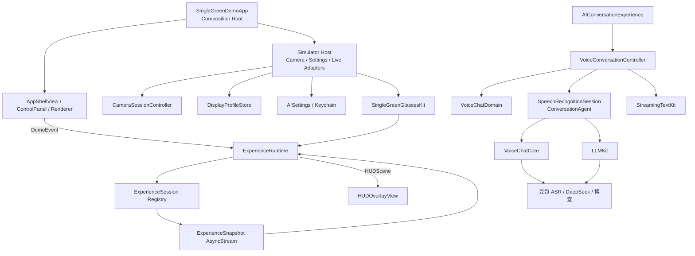

# 单绿显示实验室：项目架构、质量与模块化升级报告

> 文档状态：当前实现基线
>
> 最后审查：2026-08-28
>
> 适用工程：`SingleGreenDemo.xcodeproj`
>
> 当前版本：0.1（Debug / MVP）

## 1. 执行摘要

本项目已经从单页演示程序演进为两层结构：`SingleGreenDemo` 是相机模拟与调试宿主，`SingleGreenGlassesKit` 是可独立迭代的眼镜核心。核心包负责统一交互事件、Experience 生命周期、HUD 语义模型和 AI 对话编排；模拟器宿主负责相机、显示 Profile、SwiftUI 渲染、设置与生产适配器。

当前架构整体评分为 **8.6 / 10**，生产就绪度为 **7.2 / 10**。核心边界、Runtime 快照契约、Ports/Adapters、Swift 6 严格并发与自动化发布门禁已建立；主要限制改为：GitHub-hosted CI 尚未实际执行、服务端短期凭证端点仍是 fail-closed 契约桩、尚未完成真实服务/VAD/麦克风功能回归，以及外部分发前仍需选定仓库许可证。最终 P2 真机证据仅证明部署/启动稳定性，不等同于功能验收。

| 维度 | 评分 | 结论 |
| --- | ---: | --- |
| 简洁性 | 8.2 | 核心路径清楚，但 VoiceConversationController 已承担较多编排职责 |
| 模块化 | 9.0 | 眼镜核心、模拟器宿主、流式文本、Ports 与 Adapters 有独立边界 |
| 可测试性 | 9.1 | 核心 Runtime、Experience 和 AI 编排可脱离 App 独立验证 |
| 可扩展性 | 8.7 | 新 Experience 和供应商可接入；Profile v2 已具备中立校验与宿主适配边界 |
| 可移植性 | 8.8 | 依赖已纳入仓库；真实硬件 Host 尚未建立 |
| 生产就绪度 | 7.2 | 本地 CI/发布自动化基础已建立；仍缺 hosted CI、真实 API E2E、服务端短期凭证和真机功能验收 |

## 1.1 长程开发路线与任务状态

本项目按“产品设计 → 架构 → 实现 → 测试 → 评审 → 文档 → 发布”的完整流程推进。M1–M4 已完成当前自动化验证；M5 的自动化基础已完成，但不代表生产发布已批准：

| 里程碑 | 目标 | 状态 |
| --- | --- | --- |
| M1 Canonical AI/Runtime Snapshot | 让 AI Controller、Experience、Runtime 和宿主共享唯一的 `ExperienceSnapshot` 契约，提供 `currentSnapshot` 兼容入口，并对传播做原子化与去重 | 已实现并验证 |
| M2 Display Profile v2 / Hardware Boundary | 将中立显示参数与 SwiftUI 渲染拆开，为真实眼镜建立 Display/Input/Audio 适配边界 | 已实现并完成自动化验证 |
| M3 Experience Capability Catalog | 让 Experience 声明网络、麦克风、相机、后台更新和可用操作，减少宿主对类型的硬编码 | 已实现并完成自动化验证 |
| M4 Controller Decomposition / Strict Concurrency | 拆分对话控制器内部职责，消除不必要的 `@unchecked Sendable`，开启更严格并发检查 | 已实现并完成自动化验证 |
| M5 Production Readiness / Release System | 建立 CI、真实设备回归、短期凭证、结构化观测、版本迁移与发布检查 | 自动化基础已实现；hosted CI、真机/真服务与发布人工门禁待完成 |

### M7 PR1 quality baseline（本地完成，2026-08-28）

M7 PR1 建立了可审查的架构、工具链和公开 API 门禁；这只表示 PR1 本地完成，不表示 M7 整体完成。测试基于 `a2c39745b61bef71ecbfe6f2541287f86ca0e8f9` 的未提交工作树，历史稳定产品基线仍为 `5a02b2e90321265b61533b948928319cccf9f161`。架构图和 import/Xcode ownership 规则位于 `config/architecture-boundaries.json`，工具链契约位于 `config/toolchain.json`；14 个 API snapshot 覆盖七个模块的 macOS arm64 与 iOS Simulator arm64。API 增加和删除都必须显式评审，确认后才可运行 `scripts/update_public_api_baselines.sh --accept-current-api`。

本地证据：严格并发 **377/377**；包覆盖率为 StreamingTextKit 85.23%、VoiceChatDomain 99.07%、VoiceActivityDetectionKit 95.47%、SingleGreenGlassesKit 93.38%、LLMKit 89.89%、VoiceChatCore 74.50%，产物位于 `/private/tmp/SingleGreenDemo-M7-PR1-Coverage-Final`；App XCTest **62/62**，结果位于 `/private/tmp/SingleGreenDemo-M7-PR1-AppTests-Final.xcresult`；Debug generic Simulator 和 Release universal Simulator arm64+x86_64 构建通过；release credential-isolation scan 通过；架构自测（10 个负例）和 API baseline 测试通过。工具链为 Xcode 26.6 build 17F113、Swift 6.3.3、SDK 26.5。GitHub Actions 尚未运行此 workflow；PR1 未执行真机 build/install/launch、commit 或 push。唯一运行时代码变化是删除 `VoiceChatCore/AudioCapture.swift` 中未使用的条件 UIKit import。

残余 P3 风险：API updater 尚无并发调用锁；snapshot 按设计仅覆盖 arm64；文本 pbxproj parser 可能需要随未来 Xcode 格式维护。PR2 已补齐 VAD no-frame wall-clock watchdog，详情见 [PR2 任务记录](./tasks/2026-08-28-m7-pr2-lifecycle-correctness.md)。

### M7 PR2 生命周期正确性（本地完成，2026-08-28）

`VoiceActivatedASRSession` 在 source start 后启动单一 ContinuousClock-backed、可注入的单调时钟 watchdog；接受的 raw frame 按兼容策略刷新 `noSpeechFrameLimit × 20ms`（标准 15 秒）。达到 deadline 时，起音前后无帧均 fail closed 为 typed `audioUnavailable`；合法静音帧仍走自动 `.noSpeech`，levels/VAD/transport/stale/rejected frame 不作为 heartbeat。手动起音前 finish 发出 Core `.noSpeech` 后 `.finished`，起音后 finish 在完成前按 FIFO 排空 buffered tail。该变更未改变公开 API 或 API snapshot。

PR2 本地严格并发测试为 **390/390**，App XCTest 为 **62/62**；完整测试、覆盖率、构建和证据边界见 [PR2 任务记录](./tasks/2026-08-28-m7-pr2-lifecycle-correctness.md)。GitHub hosted CI、PR2 真机/真实服务/人工无障碍与光学验证尚未执行。

### M7 PR3 Public reuse contract（本地完成，2026-08-28）

PR3 新增 `SingleGreenConversationAdapters`，将 `VoiceChatCore`/`LLMKit` 到 `SingleGreenGlassesKit` conversation ports 的语义桥接从 App composition root 抽出。包内公开 `VoiceChatSpeechRecognitionAdapter`、`VoiceChatVoiceActivatedSpeechRecognitionAdapter`、`LLMKitConversationAgentAdapter` 和 `LLMKitConversationAgentAdapterPolicy`；宿主继续拥有凭证、租约、provider 配置、WebRTC factory、raw `web_search` mapping 和用户可见错误文案。低层 `PCMFrameSource`/`StreamingASRTransport` 不因 PR3 公开。

当前依赖方向为 `SingleGreenConversationAdapters → SingleGreenGlassesKit + VoiceChatCore + LLMKit`，App 仅负责组装。七个 Package 严格并发/WAE 为 **414/414**，新包 **24/24**，关键生命周期重复 **100/100**；App-hosted XCTest **55/55**（`/private/tmp/SingleGreenDemo-M7-PR3-AppTests-4.xcresult`）。适配器包覆盖率为 **347/354（98.02%）**，全包表见 [覆盖率基线](./COVERAGE_BASELINE.md)。Debug 与严格 Release Simulator 构建通过。公开 API 基线为八个模块、macOS arm64 与 iOS Simulator arm64 共 **16 snapshots**。这些均为本地证据，不包含 PR3 真机、真实服务、GitHub CI、无障碍或光学验收。

### M7 PR4 Terminal lifecycle（历史合并检查点，已由 PR5 supersede，本地完成，2026-08-28）

PR4 收紧 `VoiceConversationController` 的终态生命周期：shutdown 幂等且并发调用共享同一清理任务；生命周期、输入、reset 与自动 rearm 任务按 generation 保留并 join；shutdown 后拒绝迟到事件和新操作，并只发布一个终态快照。`ExperienceRuntime.init(validating:)` 作为加法 API 提供 catalog 校验入口，保留既有初始化兼容性。

PR3+PR4 合并历史本地证据为七个 Package **438/438**（7、16、43、174、24、70、104）、App **55/55**（`/private/tmp/SingleGreenDemo-M7-Combined-QA-App.xcresult`）；适配器重复 **480** 次、终态生命周期重复 **380** 次。`SingleGreenGlassesKit` 覆盖率 **94.08%**，适配器包 **98.02%**；Debug 与严格 universal Release Simulator arm64+x86_64 构建通过；API 为八模块/16 snapshots；架构边界自测为 **11 个负例**。该证据已由当前 PR5 隔离复测 supersede，未声明真机、实时服务、GitHub CI、无障碍或光学验证。

### M7 PR5 Mechanical decomposition（本地完成，2026-08-28）

PR5 是行为中性的机械拆分，严格限定为四个文件：内部 `ConversationTelemetryTracker` 抽离同步 telemetry phase bookkeeping，`VoiceConversationController` 仍拥有所有任务、取消、generation、reply/display identity 和生命周期状态；测试支持与 fixture 移入独立文件，95 个 Controller 测试方法的名称、方法体和断言保持不变。`ConversationInputCoordinator`、`ExperienceRuntime` 和 `ConversationLiveAdapters` 不在本 PR5 范围内。

隔离 PR5 证据为 SGK **174/174**，七 Package **438/438**，关键用例 **17×20=340/340**，App **55/55**（`/private/tmp/SingleGreenDemo-M7-PR5-AppTests-Retry/Logs/Test/Test-SingleGreenDemo-2026.08.28_19-46-03-+0800.xcresult`）；覆盖率为 SGK **93.91%**、适配器 **98.02%**。16 个 API snapshots byte-identical，架构负例 11 个；Debug 与 universal Release Simulator 构建通过，独立评审为 GO。PR5 未执行真机、真实服务、GitHub CI、commit 或 push。详见 [PR5 任务卡](./tasks/2026-08-28-m7-pr5-mechanical-decomposition.md)。

非权威并发 timing-warning 结果：`/private/tmp/SingleGreenDemo-M7-PR5-AppTests.xcresult`。

### M8 Dependency & Composition Refinement（本地完成，2026-08-29）

M8 将核心 `VoiceConversationDependencies` 收敛为四个公开 immutable value groups：`VoiceConversationInputDependencies`、`VoiceConversationAgentDependencies`、`VoiceConversationPresentationDependencies` 与 `VoiceConversationObservabilityDependencies`。`VoiceConversationDependencies` 提供按组装配的 initializer；原有 flat initializer 与 11 个 accessor 仍保留，保证 source-package compatibility，但不承诺 Swift struct 的 binary layout 或 ABI。Controller 的 Task、generation、cancellation、session、reply 与 display ownership unchanged。

App composition 现在由小型 `ConversationDependencies.swift` live entry 触发，职责拆到五个文件：`ConversationCredentialProvider.swift`（credential leases/providers）、`ConversationPreparationResolver.swift`（settings-derived input/ASR/Agent preparation）、`ConversationPresentationPolicy.swift`（reviewed copy）、`ConversationTelemetryStore.swift`（host telemetry）和 `ProductionVoiceActivatedSessionFactory.swift`（inactive production VAD/ASR factory）；`VoiceConversationComposition.swift` 负责把它们组装成一套依赖。Composition 接收同一个 resolver，resolver exclusively owns settings-derived input mode、ASR preparation 与 Agent behavior，避免 A/B misassembly。`AgentFactory` 仅是 internal test seam，不是公共扩展点。

本轮明确不引入 Service Locator、global registry 或 runtime hot swap。LLMKit 是否拆分，延后到出现第二个 independently shipped transport/provider SDK/platform consumer 需求后再决定；Experience/Provider Registry 延后到有真实 runtime switching requirement、至少两个 production implementations，并明确 lifecycle/context semantics 后再设计。

M8 本地证据：`SingleGreenGlassesKit` **178/178**；App XCTest **58/58**；focused `ConversationPreparation` **17/17**；controller + dependency regression **99/99**。八个模块、macOS arm64 与 iOS Simulator arm64 共 **16 snapshots** 已人工审查：仅 `SingleGreenGlassesKit` 两份 snapshot 变化，各 **39 additions / 0 removals**。架构门禁覆盖七个 Package 与 **11** 个 negative fixtures；Debug 与 Release generic Simulator builds passed。首次全局 `SWIFT_TREAT_WARNINGS_AS_ERRORS` 与 package `-suppress-warnings` 的冲突记录为 tooling evidence，不是 source failure。该轮没有执行 physical-device build/install/launch 或 real-service validation。

### M1 已实现的契约

- `ExperienceSession` 以 `currentSnapshot(eventDescription:)` 提供同步兼容入口，以 `updates()` 提供后台变化流。
- `ExperienceRuntime` 持有唯一公开快照，激活、事件和后台更新都汇入同一个 `ExperienceSnapshot` 发布路径。
- Runtime 通过 command generation 和当前 Session 身份校验隔离迟到更新；相同快照不会重复传播。
- `AIConversationExperience` 从 Controller 的 canonical snapshot 转发状态，不再分别拼装 scene、action 和 control state。
- 已保留本轮 UX 契约：HUD 约 8:3、宽度 `0.90`、垂直偏移 `-0.035`、打字节奏 `150ms`。

M1 的自动化证据与残余人工检查见第 7 节以及 [M1 任务卡](./tasks/2026-08-28-long-term-roadmap.md)。

### M2 已实现的 Display Profile v2

`SingleGreenGlassesKit.DisplayProfile` 是设备无关、不可变且 `Sendable` 的中立值模型，包含：稳定标识和名称、可见区域长宽比、显示面宽度比例、九宫格对齐方式、垂直偏移、归一化 viewport、不对称 safe area、文字/行缩放和 RGB 颜色分量。模型提供由 viewport 与 safe area 推导的可见宽高比例和 presentation container aspect ratio。

初始化时执行类型化校验：空标识、非有限数值、非正值、宽度/偏移范围、viewport 越界、负 safe-area 边缘、safe-area 横纵向塌缩、颜色分量范围，以及派生 presentation aspect ratio 的浮点 overflow/underflow 均有明确的 `DisplayProfileValidationError`。这使错误在进入渲染层前被拒绝。

默认 `simulator.default.v2` 精确值为：可见区域 `8:3`、宽度 `0.90`、`center` 对齐、垂直偏移 `-0.035`；viewport 为 `(0.08, 0.12, 0.84, 0.60)`，safe area 为上/左/下/右 `(0.10, 0.08, 0.10, 0.08)`。`calibration.fixture.non-production.v1` 是用于几何和 UI 测试的非生产标定 Fixture，不代表真实眼镜的光学参数。

核心包不依赖 SwiftUI 或 CoreGraphics。`SingleGreenDemo` 仅在宿主侧提供 SwiftUI/CoreGraphics 投影、颜色和矩形转换器，以及进程内 `DisplayProfileStore` 选择器；Profile 选择不会进入 Runtime、Experience 状态或活动 AI 流，切换 Profile 只改变宿主渲染配置。

### M3 已实现的 Experience Capability Catalog

每个 `ExperienceSession` 自己拥有不可变的 `ExperienceDescriptor`，descriptor 包含展示元数据、`ExperienceCapabilities` 和动作描述；Runtime 通过经校验的 `ExperienceCatalog` 管理它们。Catalog 对空目录、重复 kind、缺失元数据、重复/空动作 ID、无效标题/图标/无障碍标签和多个 primary action 返回类型化错误。descriptor 的顺序按兼容契约固定为：`conversation`、`systemStatus`、`navigation`、`notification`、`caption`。

当前真实能力声明为：AI 对话为 `.network`、`.microphone`、`.backgroundUpdates`；状态、导航、通知、字幕/提词为本地体验，能力集合为空。能力是声明式 metadata，用于描述和编排，不自动执行相机、麦克风或网络权限 gating；权限和服务可用性仍由对应宿主/用例处理。AI 的 provider detail 由宿主注入 descriptor，核心包不持有供应商细节。内建 ID 与扩展注册均遵循同一 canonical grammar。

Runtime 对宿主公开 `availableDescriptors`、`selectedDescriptor`、`activeActions` 和 `performAction(id:expectedKind:)`；控制面板按 descriptor 和 action placement 渲染，次级动作使用自适应网格，不再按 `ExperienceKind` 写 UI switch。通知体验的稳定 primary action 是 `显示提醒`，其 `triggerAlert` 事件使提醒可见；`tap` 或 `swipeDown` 关闭提醒，保持既有触发语义。

M3 保持 M1 的 canonical `ExperienceSnapshot` 不变。异步更新通过带 provenance 的 `ExperienceUpdate` 传递，来源区分 opaque command token 与 spontaneous；`TaskLocal` 捕获命令上下文，跨回调场景使用公开 `ExperienceUpdateSource.current` 显式标记。Runtime 按 Session 身份和 token 过滤旧更新；action、reset、activation 使用 `expectedKind` 定位目标，激活中点也再次检查当前 Session。AI 输入使用 `inputOperationGeneration`，取消后迟到的 ASR start 不会重新激活旧操作。

能力目录的新增流程应复用测试中的 descriptor fixture/example：先固定唯一 raw ID 和完整宿主 metadata，再声明真实 capability/action，验证 catalog、active action、异步 provenance、取消竞态和宿主自适应布局；能力声明本身不应被当作权限实现。Experience ID 必须使用大小写敏感的 ASCII 语法 `[A-Za-z0-9][A-Za-z0-9._-]*`，首字符必须为字母或数字，禁止空格、Unicode、前导标点和隐式 trim/normalize。

### M4 已实现的 Controller 与并发边界

`VoiceConversationController` 仍是公开的 `@MainActor` sole state/snapshot façade；调用方继续通过它读取会话状态和 canonical `ExperienceSnapshot`。内部职责已提取为 `ConversationInputCoordinator`、`ConversationReplyPipeline`、`ConversationDisplayScheduler` 和 `ConversationLifecycleProjection`。初次抽取曾将 Controller 从 590 行降至 373 行；当前 620 行包含 M5 的凭证等待 generation、宿主生命周期串行化和单终态遥测收口。内部边界仍保持拆分；行数本身不作为发布质量门禁。

LLM Agent 现在支持 staged transaction：回复先产生候选事务和 token，只有显示追平且领域接受后才显式 `commit`；取消、失败、显示追平失败、领域拒绝或 commit 失败均显式 `abort`，不得把候选上下文当作已提交历史。输入操作使用 generation，取消时立即失效旧 generation，并清理旧 ASR start；Controller 提供公开 `shutdown()`，deinit 也负责取消活动输入、回复和显示任务。Runtime 的 observation shutdown 会停止各 Session 更新任务并关闭下游资源。

`ASRSession` 修复了 event-cycle 与生命周期串行化问题，start/finish/cancel 不再交叉发出重复或迟到事件。生产语音适配器改为 actor。音频转换使用精确的 PCM snapshot，保留 ASBD、channel layout、channel count、interleaving 等信息，诊断只输出经过清洗的类别，不泄露 framework 原文或录音数据。`ObservationBox` 已移除。

M4 当时的五个 Package manifest 均启用 Swift 6；当前新增的第六个 `VoiceActivityDetectionKit` 也纳入相同 complete concurrency 与 warnings-as-errors 门禁。App 和测试 Target 的 Debug/Release 保持 Swift 6 complete/WAE。当前生产代码的 `@unchecked Sendable` 仅存在于五个有明确同步理由的边界：`VoiceChatCore.ASRSession`、`LegacyAudioCaptureCallbacks`、`AudioCaptureRunState`、`PCMFrameSourceRelay` 和 App 的 `CameraSessionPipeline`；不应重新扩大该边界。

## 2. 产品定位与边界

### 2.1 当前目标

- 使用 iPhone 后置摄像头提供真实环境背景。
- 在摄像头画面上模拟单绿色 OST HUD 的布局、亮度和信息密度。
- 使用统一 Runtime 快速切换、演示和验证多种 Experience。
- 验证 AI 语音对话链路：流式 ASR、多轮 LLM、模型按需联网搜索。
- 为未来接入真实眼镜显示、手势输入、更多 AI 工具和远程数据源保留稳定接口。

### 2.2 明确非目标

- iPhone 叠加画面不等同于真实单绿眼镜的光学表现。
- 当前不是生产级账号、计费、数据同步或多用户系统。
- Debug/内部演示模式可使用本机 Keychain；Release 不编译演示密钥 UI/读写路径，在服务端短期凭证传输接入前 fail closed。
- 当前不承诺真实网络服务的稳定性；离线单元测试只验证编排与协议行为。

### 2.3 当前 Experience

| Experience | 数据来源 | 主要用途 |
| --- | --- | --- |
| SystemStatus | 本地状态与注入时钟 | 状态、时间、边界交互示例 |
| Navigation | 本地路线 Fixture | 多步骤、展开和边界事件示例 |
| Notification | 本地通知 Fixture | 打断、显示与关闭示例 |
| Caption | 本地字幕 Fixture | 连续推进、播放与停止示例 |
| AIConversation | 豆包 ASR + DeepSeek + 博查 | 异步后台更新、语音和 Agent 工具链示例 |

## 3. 当前总体架构



### 3.1 依赖方向

必须保持以下单向依赖：

```text
SingleGreenDemo simulator host
   ↓
SingleGreenGlassesKit public API
   ↓
Runtime + Experience contracts + HUD domain models

AIConversationExperience
   ↓
VoiceConversationController
   ↓
Core ports
   ↓
SingleGreenDemo live adapters
   ↓
AiiOSStudy packages / system frameworks / network services
```

眼镜核心包不得依赖 SwiftUI、UIKit、AVFoundation、相机、Keychain、设置持久化或供应商 SDK。生产适配器可以依赖外部模块，但控制器只应依赖端口。模拟器控制面板只消费 `ExperienceControlState`，不直接读取具体 Experience 的 Controller。

## 4. 核心运行流程

### 4.1 普通 Experience 事件流

```text
用户按钮或手势
→ DemoEvent
→ ExperienceRuntime.handle
→ 当前 ExperienceSession.handle/reset
→ HUDScene + action title
→ Runtime 发布
→ HUDOverlayView 渲染
```

`ExperienceRuntime` 是当前场景、主动作标题和调试事件的唯一发布者。UI 不应直接从具体 Experience 读取 HUD 输出。

### 4.2 后台更新流

AI 对话不是一次输入对应一次同步输出。ASR 音量、实时转写、LLM 请求和搜索状态会在后台持续变化，因此 `ExperienceSession.updates()` 使用 `AsyncStream<ExperienceSnapshot>` 向 Runtime 推送最新状态。Runtime 只接受当前激活 Session 的更新，旧 Session 的延迟更新会被丢弃。

### 4.3 并发与竞态保护

Runtime 对激活和普通事件共用 `commandGeneration`：

1. 每个新命令递增 generation。
2. 异步 reset/handle 返回后检查 generation。
3. 同时检查处理命令的 Session 仍是当前 Session。
4. 任一条件不满足时，不再发布旧结果。

AI Controller 对回答使用独立 reply generation 和回复 UUID。重置、打断或新会话会取消旧任务；旧回复、旧失败和重复 finished 事件不能污染新会话。

LLM 网络累计文本与 HUD 可见文本分开管理：`ConversationState` 按 reply UUID 立即累加真实 SSE delta，`StreamingTextKit.TypewriterTextBuffer` 再以 Swift `Character` 边界和当前注入的 150ms tick 平滑追平。节奏由 `TypewriterPolicy` 注入，Unicode 完成对齐与滚动判定也是无 UI 副作用的模块算法。Controller 只编排状态和 tick；所有网络事件与打字 tick 同时校验 UUID 与 generation。

### 4.4 AI 对话链路

```text
Runtime tap
→ AIConversationExperience
→ VoiceConversationController
→ 麦克风权限
→ VoiceChatCore.ASRSession
→ 累计 transcript
→ VoiceChatDomain.ConversationState
→ LLMKit.LLMAgent
→ 可选 web_search 工具
→ BochaSearchClient
→ 最终回答 SSE delta
→ ConversationState pending 累加
→ StreamingTextKit 字素安全展示
→ ConversationHUDMapper
→ ExperienceSnapshot
→ Runtime
→ HUD
```

状态机为：

```text
idle
→ connecting
→ listening
→ recognizing
→ thinking
→ searching（可选）
→ streaming
→ completed / failed
```

`LLMChatClient.completeMessageStreaming` 同时解析 `content` 与按 index 分片的 `tool_calls`。`LLMAgent` 仅依赖 `LLMChatTransport`，供应商 HTTP/SSE、本地模型或网关可以独立替换。`sendStreaming` 把单轮用户请求视为事务：最终无工具轮才提交助手上下文；失败或取消不得提交。

AI 回答布局使用专用 `flowingText` 元素，高度为 safeRect 的 61%，保持固定字号和左对齐。`HUDFlowingTextView` 通过尾部 anchor 自动上翻；Reduce Motion 下不执行逐字或滚动动画。流式中的文本对 VoiceOver 隐藏，完成后以整体文本提供读取，避免逐 token 播报。

## 5. 模块职责与稳定接口

| 目录或模块 | 责任 | 对外稳定接口 | 不应承担 |
| --- | --- | --- | --- |
| `App/` | Composition Root、页面装配、生命周期 | Environment Objects | 业务状态机、网络协议 |
| `Packages/SingleGreenGlassesKit/Domain/` | HUD、事件、归一化几何 | 值类型模型 | SwiftUI 页面、SDK 实现 |
| `Packages/SingleGreenGlassesKit/Runtime/` | 注册表、切换、事件串行语义、统一发布 | `ExperienceSession`、`ExperienceSnapshot` | 具体体验逻辑 |
| `Packages/SingleGreenGlassesKit/Experiences/` | 每个体验自己的状态与事件映射 | `ExperienceSession` | 全局导航、其他体验状态 |
| `Platform/Rendering/` | 将 HUDScene 映射为视觉 | `HUDOverlayView` | 修改体验状态 |
| `Platform/Profiles/` | 宿主 Profile 选择与 SwiftUI/CoreGraphics 投影 | `DisplayProfileStore`、`HUDPreviewProjection` | 中立 Profile 校验、体验内容 |
| `Platform/Environment/` | 相机权限和 Session 生命周期 | `CameraSessionController` | HUD 或 AI 业务 |
| `Packages/SingleGreenGlassesKit/AI/` | AI 用例、端口、对话编排与四组 immutable dependencies | ASR/Agent ports、`VoiceConversationController`、按组 initializer；flat initializer/11 accessors 为 source-package compatibility | 生产 SDK、Keychain、App 页面布局；不承诺 struct binary layout/ABI |
| `SingleGreenDemo/Platform/AI/` | 小型 live entry 加五个职责文件：credentials、preparation resolver、presentation policy、telemetry、production VAD/ASR factory，以及共享 composition | `VoiceConversationDependencies.live`、`ConversationLiveAdapters` | 眼镜核心状态机与可复用 semantic bridge；不使用 Service Locator/global registry/hot swap |
| `SingleGreenConversationAdapters` | VoiceChatCore/LLMKit 到眼镜核心 ports 的可复用语义桥接 | 四个 public adapter/policy 类型 | 凭证、provider 配置、UI、raw provider tool mapping |
| `StreamingTextKit` | 打字节奏、字素缓冲、Unicode 对齐、自动尾随策略 | `TypewriterPolicy`、`TypewriterTextBuffer`、`StreamingTextReconciler` | 会话状态、SwiftUI 样式、网络 |
| `VoiceChatDomain` | 消息和回复生命周期 | `ConversationState` | 音频、网络、UI |
| `VoiceChatCore` | 音频、ASR WebSocket、协议帧和 VAD 门控会话 | `ASRSession`、`VoiceActivatedASRSession`、`PCMFrameSource` | LLM 和 HUD |
| `VoiceActivityDetectionKit` | 20ms PCM 帧契约、检测器 port、VAD 分段状态机 | `VADPCMFrame`、`VoiceActivityDetecting`、`VADSegmenter` | 录音、网络、UI、供应商 detector |
| `LLMKit` | Chat Completions、SSE、上下文事务、工具循环、搜索 | `LLMChatTransport`、`LLMAgent` | 麦克风、HUD 和 App 生命周期 |

## 6. 配置与安全

### 6.1 当前存储策略

| 配置 | 存储 |
| --- | --- |
| ASR / LLM / 博查长期 Key | 仅 Debug/内部演示 Keychain；Release 不编译该读写路径 |
| Release AI 凭证 | 服务端短期租约契约；当前 transport fail closed |
| ASR Resource ID、语言、热词 | UserDefaults / AppStorage |
| LLM 模型、搜索开关、免按模式 | UserDefaults / AppStorage |

旧 `Volcengine.plist` 配置路径已删除。Debug 演示凭证只能通过明确标记的内部设置页写入 Keychain；Release 只接受未来的服务端签发流程。任何凭证都不得写入源码、plist、README、测试 Fixture 或截图。

### 6.2 生产升级要求

1. App 不直接持有长期供应商密钥；改为业务服务端签发短期 Token。
2. 为 ASR、LLM 和搜索分别配置超时、限流、重试上限与错误分类。
3. 日志只记录 request ID、阶段、耗时和错误类型，不记录原始 Key 或完整语音文本。
4. 明确语音与对话数据的隐私说明、保留周期和删除策略。
5. Keychain service 名称在 Bundle ID 变更时需要迁移方案。

### 6.3 M6 Stage 2A：VAD 门控 ASR

`VoiceActivityDetectionKit` 与 `VoiceChatCore` 的边界已经建立：前者只处理 20ms/16kHz/mono/Int16LE 帧、detector port 和纯分段状态机；后者把 `AudioCapture` 转为有界帧流，并由 `VoiceActivatedASRSession` 在本地起音确认后才打开 ASR transport。`SingleGreenGlassesKit` 只消费宿主准备好的 provider-neutral PTT/VAD session 与 Agent，不持有供应商配置。

当前标准策略为 300ms bounded pre-roll、3-of-5 onset、800ms trailing silence、20s maximum segment、15s no-speech timeout；source 与 pending-upload 队列均有界，上传批次为 10 帧（200ms）。取消、reset、音频错误、过载或 detector 不可用均 fail closed。手动 PTT 保持兼容。

眼镜核心只接收宿主准备好的 provider-neutral PTT/VAD session 与 Agent；它使用 opaque Agent context identity、semantic external-information activity，并在取消或新一代操作时丢弃 stale preparation。API keys、provider model/resource configuration、credential leasing、validation copy 和 raw `web_search` mapping 仅由 `SingleGreenDemo` 的 resolver/adapters 处理。

获批准的最小 WebRTC detector 已集成并仅在 `SingleGreenDemo` composition root 链接；能量检测器仅限 benchmark/test-support，禁止作为上传回退。production root factory 非空但在 arm 前 inert，mode 2 为 `.aggressive`；独立 AISettings 仍 fail closed。后审计覆盖连续免按 rearm、音频中断/路由/media-services-reset 通知 wiring、意外 ASR stream closure、开放宿主自定义 Experience 注册和完整工具调用参数校验。

App 内部 `VoiceActivatedFactory` 为 throwing contract：错误映射为 reviewed safe copy；成功准备返回 inactive session，只有后续显式 arm 才开始捕获；PTT 路径绕过该 factory。生产 root 注入 WebRTC factory，独立 AISettings 仍 fail closed。

生产 detector 的 WebRTC 依赖已获用户批准并纳入。11 upstream C + 1 project compatibility C + 12 upstream headers 由 hidden wrappers 和五符号 facade 封装，raw upstream C 不直接编译；来源、provenance/hash、许可证和剩余人工门禁见 [WebRTC VAD 依赖审批 ADR](./tasks/2026-08-28-webrtc-vad-approval-adr.md)。

## 7. 测试体系与当前证据

### 7.1 当前测试结果

PR3 集成工作树的历史本地严格门禁证据（已由 PR3+PR4 supersede，PR3+PR4 又已由 PR5 supersede）：

| 测试层 | 数量 | 结果 |
| --- | ---: | --- |
| VoiceChatCore | 91 | 通过 |
| VoiceActivityDetectionKit | 43 | 通过 |
| SingleGreenGlassesKit | 150 | 通过 |
| VoiceChatDomain | 16 | 通过 |
| LLMKit | 70 | 通过 |
| StreamingTextKit | 7 | 通过 |
| SingleGreenConversationAdapters | 24 | 通过 |
| 七个 Package 合计 | **414** | **0 失败** |

PR1 的六个 Package **377/377**、PR2 的六个 Package **390/390**、PR3 的七个 Package **414/414**（适配器 **24/24**、关键重复 **100/100**）以及 PR3 App **55/55** 均属于历史证据。PR3+PR4 历史合并门禁为七个 Package **438/438**（7、16、43、174、24、70、104）、App **55/55**，适配器重复 **480** 次、终态生命周期重复 **380** 次；结果包为 `/private/tmp/SingleGreenDemo-M7-Combined-QA-App.xcresult`。该历史快照已由当前 PR5 隔离复测 supersede。覆盖率和构建证据见 PR4 记录及 [COVERAGE_BASELINE.md](./COVERAGE_BASELINE.md)。

FinalQA2 的 focused evidence 还包括 `VoiceActivatedASRSession` **24/24** 与 `VoiceConversationController` **77/77**。最终修复覆盖：同一 context 下未使用的 prepared Agent 会被 discard；credential account scope 稳定且不含秘密，每次调用刷新凭证并隔离 account；未知错误只输出安全 copy；credential resolution 挂起期间可取消；DEBUG 持久化的非敏感 account revision 具备明确的 revision 语义。

以下 M5 及更早数据是各里程碑当时的历史证据。M5 最终 Owner finding 修复后的本地自动化证据：

| 测试层 | 数量 | 结果 |
| --- | ---: | --- |
| StreamingTextKit | 7 | 通过 |
| VoiceChatDomain | 15 | 通过 |
| SingleGreenGlassesKit | 125 | 通过 |
| LLMKit | 63 | 通过 |
| VoiceChatCore | 44 | 通过 |
| App-hosted XCTest | 35 | 通过 |
| 合计 | **289** | **0 失败** |

五个 Package 共 254 项，均通过 Swift 6 complete strict-concurrency + warnings-as-errors 门禁，ASRCLI 产品也单独通过同等级构建。App 结果包为 `/private/tmp/SingleGreenDemo-M5-OwnerFinal-App.xcresult`。Release generic Simulator 构建包含 `arm64 + x86_64`，演示凭证二进制隔离断言通过。覆盖率报告保留在 `/private/tmp/SingleGreenDemo-M5-OwnerFinal-Coverage`。这些是本地证据，不代表 GitHub-hosted runner、签名真机、真实服务或光学验证已完成。

以下 M4/M3/M2/M1 数据是各里程碑当时的历史证据：

M4 Controller decomposition / strict concurrency 的最终验证结果：

| 测试层 | 数量 | 结果 |
| --- | ---: | --- |
| StreamingTextKit | 7 | 通过 |
| VoiceChatDomain | 14 | 通过 |
| SingleGreenGlassesKit | 107 | 通过 |
| LLMKit | 62 | 通过 |
| VoiceChatCore | 35 | 通过 |
| App-hosted XCTest | 23 | 通过 |
| 合计 | **248** | **0 失败** |

App-hosted 结果包：`/private/tmp/SingleGreenDemo-M4-CommitAck-QA/Logs/Test/Test-SingleGreenDemo-2026.08.28_04-05-35-+0800.xcresult`。Release generic `arm64 + x86_64` Simulator build 通过，最终 QA/评审未发现 P0–P2 问题。M4 未执行物理设备安装/启动、真实 ASR/LLM/Search 服务或设备视觉/无障碍验证。

M3 Experience Capability Catalog 的最终验证结果：

| 测试层 | 数量 | 结果 |
| --- | ---: | --- |
| SingleGreenGlassesKit | 86 | 通过 |
| App-hosted XCTest | 23 | 通过 |
| M3 直接范围合计 | **109** | **0 失败** |

紧邻本次 QA 的依赖回归已新鲜通过：VoiceChatDomain 14/0、VoiceChatCore 25/0、LLMKit 59/0、StreamingTextKit 7/0。加上 M3 直接范围，共 **214 项相关测试，0 失败**；依赖套件未在 M3 代码范围内重复计入。通用 `arm64 + x86_64` Simulator build 通过，最终 QA/评审未发现 P0–P2 问题。App-hosted 结果包：`/private/tmp/SingleGreenDemo-M3FinalReview/Logs/Test/Test-SingleGreenDemo-2026.08.28_02-49-02-+0800.xcresult`。

本次没有执行物理设备安装/启动、真实 ASR/LLM/Search 服务或手工视觉验证；这些仍属于后续人工/发布门禁。

M2 Display Profile v2 的最终验证结果：

| 测试层 | 数量 | 结果 |
| --- | ---: | --- |
| SingleGreenGlassesKit | 54 | 通过 |
| VoiceChatDomain | 14 | 通过 |
| VoiceChatCore | 25 | 通过 |
| LLMKit | 59 | 通过 |
| StreamingTextKit | 7 | 通过 |
| App-hosted XCTest | 20 | 通过 |
| 合计 | **179** | **0 失败** |

通用 `arm64 + x86_64` Simulator build 通过，最终 QA/评审未发现 P0–P2 问题。M2 仍未执行设备安装、设备启动或真实 ASR/LLM/Search 服务验证；模拟器视觉对照和真实眼镜光学标定仍是人工待办。

M1 快照契约硬化于 2026-08-28 完成。实现后的首次完整 QA 为五个 Package **150** 项 + App-hosted **13** 项，合计 **163/0**；随后修复两项 P2 问题，受影响范围复测为 SingleGreenGlassesKit **46** 项 + App-hosted **13** 项，合计 **59/0**。两次验证均包含通用 Simulator build，结果通过。

| 验证批次 | 范围 | 数量 | 结果 |
| --- | --- | ---: | --- |
| M1 首次完整 QA | 五个 Package | 150 | 通过 |
| M1 首次完整 QA | App-hosted XCTest | 13 | 通过 |
| M1 首次完整 QA | 合计 | **163** | **0 失败** |
| M1 P2 修复后受影响复测 | SingleGreenGlassesKit | 46 | 通过 |
| M1 P2 修复后受影响复测 | App-hosted XCTest | 13 | 通过 |
| M1 P2 修复后受影响复测 | 合计 | **59** | **0 失败** |

当前 M1 构建证据：通用 `platform=iOS Simulator` build 通过。M1 证据不包含签名 iphoneos build、真机安装、真机启动或真实 ASR/LLM/Search 服务验证；这些属于后续 M5 或单独发布任务。历史上抽取前的 156 项测试、签名 iphoneos arm64 build 和真机 AI 链路只能作为历史基线，不代表 M1 已重新验证。

独立 `streaming_qa` 专项 QA 代理容量曾连续两次不可用；随后由等价的独立确定性测试与构建回归完成 QA 兜底。该事实不改变测试结果，但说明后续长程任务需要保留人工/独立验证路径。

当前七个 Package 只统计各自 canonical `Sources/<package-name>/` 的生产行覆盖率；benchmark/test-support 和可执行工具不计入生产库覆盖率：

| 目标 | 覆盖行 / 生产源码行 | 行覆盖率 |
| --- | ---: | ---: |
| StreamingTextKit | 75 / 88 | 85.23% |
| VoiceChatDomain | 106 / 107 | 99.07% |
| VoiceActivityDetectionKit | 379 / 397 | 95.47% |
| SingleGreenGlassesKit | PR5 isolated measured baseline | 93.91% |
| LLMKit | 925 / 1029 | 89.89% |
| VoiceChatCore | 2051 / 2706 | 75.79% |
| SingleGreenConversationAdapters | 347 / 354 | 98.02% |

详细分子/分母、门槛和 ASRCLI 排除边界见 [COVERAGE_BASELINE.md](./COVERAGE_BASELINE.md)。

### 7.2 已覆盖的关键行为

- Experience 注册、重复类型拒绝和未知类型处理。
- 模拟器通过 `ExperienceControlState` 获取状态，不依赖具体 Controller。
- 激活顺序、reset 等待和旧异步事件隔离。
- 后台 ExperienceSnapshot 进入 Runtime。
- HUD 归一化边界和安全区。
- 累计转写、重复结束事件去重和 ASR 错误。
- 麦克风拒绝、缺失配置和 Agent 失败。
- 搜索状态、配置快照、回复取消和上下文清理。
- 注入时钟驱动的 VAD 门控、端点和 bounded-queue 测试，无真实麦克风或网络等待。
- Domain 回复 UUID 隔离、失败回滚和旧回复防覆盖。
- pending delta 累加、部分失败保留、完成时机和 Reset 迟到事件隔离。
- StreamingTextKit 字素边界、combining scalar、自适应追平、可注入策略、Unicode 对齐和自动跟随。
- ASR 帧、gzip、LLM 编码、SSE 正文/工具分片、流式工具轮、重试、工具调用和博查响应。

### 7.3 尚未覆盖

- 带真实凭证的 ASR → LLM → 搜索端到端自动化。
- 真实网络切换、Bluetooth/有线麦克风路由、系统音频中断和 media-services reset；当前只有注入 seam 的确定性测试。
- 相机权限各状态的自动 UI 验收。
- VoiceOver、动态字体、横竖屏和不同设备尺寸矩阵。
- 长时间会话的内存、功耗、温升和上下文成本。

### 7.4 M1 验收清单与残余人工检查

已完成的 M1 验收项：

- [x] Controller、AI Experience 和 Runtime 使用 canonical `ExperienceSnapshot`。
- [x] `currentSnapshot` 兼容入口和 `updates()` 后台流均可用。
- [x] 激活、事件和后台更新共用 generation / Session identity 隔离。
- [x] 相同快照不重复传播；快照字段保持原子一致。
- [x] 8:3、`0.90`、`-0.035` 和 `150ms` UX 值保持不变。
- [x] M1 首次完整 QA 163/0，P2 修复后影响范围 59/0。
- [x] 通用 Simulator build 通过，最终评审未发现 P0–P2 问题。

后续仍需人工验证：

- [ ] 在目标真机上检查相机权限、HUD 位置、可读性和连续交互。
- [ ] 使用有效凭证执行 ASR → LLM → Search 真实链路，并记录脱敏结果。
- [ ] 在真实网络和音频硬件上验证切网、Bluetooth/有线路由、音频中断、media-services reset，并人工验证 Reduce Motion、VoiceOver 和不同屏幕尺寸。
- [ ] 在真实硬件出现后验证光学显示、输入和设备级功耗。

### 7.5 M3 验收清单与残余人工检查

- [x] 五个 raw ID 和固定顺序通过兼容性测试。
- [x] Session-owned immutable descriptor、能力集合和动作目录通过 catalog 类型化校验。
- [x] Runtime 暴露 descriptor/action API，宿主控制面板改为 descriptor-driven，无 `ExperienceKind` UI switch。
- [x] `显示提醒` 的 `triggerAlert`、关闭和 deduplicated visibility 语义通过测试。
- [x] `ExperienceUpdate` provenance、opaque token、TaskLocal/current source、Session/token filtering 通过测试。
- [x] `expectedKind`、激活中点保护、input operation generation 和 ASR 取消后迟到 start 通过测试。
- [x] 次级动作网格能按动作数量自适应，fixture/example checklist 已提供。
- [x] M3 直接范围 109/0，连同紧邻依赖回归共 214/0；通用 Simulator build 通过；最终 QA/评审无 P0–P2。

仍需人工验证：

- [ ] 在目标模拟器上逐个对照五个 descriptor、primary/secondary action 的视觉和无障碍呈现。
- [ ] 确认能力 metadata 不被误当作自动权限 gating，并在宿主权限拒绝时检查 AI 体验行为。
- [ ] 真机、真实服务和真实眼镜光学验证仍未执行。

## 8. 模块化扩展指南

### 8.1 新增普通 Experience

1. 在 `Packages/SingleGreenGlassesKit` 的 `ExperienceKind` 增加稳定标识；标识发布后不要随意修改。
2. 在核心包中新建独立目录和 `ExperienceSession` 实现。
3. 将内部状态保持为私有，只输出 `HUDScene` 和主动作标题。
4. 同步变化在 `handle/reset` 返回后由 Runtime 发布。
5. 后台变化通过 `updates()` 发布 `ExperienceSnapshot`。
6. 在 Composition Root 注册，不在 Runtime 内写具体类型判断。
7. 至少增加初始状态、事件边界、reset、后台更新和竞态测试。

最小模板：

```swift
@MainActor
final class ExampleExperience: ExperienceSession {
    let kind: ExperienceKind = .example
    private(set) var scene: HUDScene = /* initial scene */
    var primaryActionTitle: String { "执行" }

    func handle(_ event: DemoEvent) async {
        // mutate private state, then rebuild scene
    }

    func reset() async {
        // restore deterministic initial state
    }
}
```

### 8.2 替换 ASR 供应商

- 新适配器实现 `SpeechRecognitionSession`。
- 将供应商事件归一化为 transcript、utterance、level、finished、failed。
- 不修改 `VoiceConversationController`。
- 在 `VoiceConversationDependencies.live` 或新的 Provider Factory 中切换。
- 增加协议映射、取消、重复完成和错误转换测试。

### 8.3 替换 LLM 或搜索供应商

- 只替换 LLM 网络/模型时，实现 `LLMChatTransport`，继续复用 `LLMAgent` 的上下文事务和工具循环。
- 替换整个 Agent 编排时，实现 App 层 `ConversationAgent`。
- 搜索或新工具实现 `LLMToolExecutor`，不将工具业务写入 Transport。
- 供应商配置形成不可变快照，在 `ConversationLiveAdapters.swift` 完成生产装配。

### 8.4 调整或复用打字效果

- `TypewriterPolicy.standard` 保留为模块兼容默认；当前眼镜产品通过 `comfortableReading` 注入 150ms 节奏。
- 新产品通过构建新 `TypewriterPolicy` 调整节奏，不 fork buffer 代码。
- 复用 `StreamingTextReconciler` 处理 SSE 最终文本，不按 Character 索引拼接后缀。
- SwiftUI 样式可替换，但自动滚动判定继续复用 `StreamingTextAutoFollowPolicy`。
- 完整接口和升级检查表见 `docs/STREAMING_MODULES_UPGRADE_GUIDE.md`。

### 8.5 新增显示硬件 Profile

- 在 `SingleGreenGlassesKit` 中新建不可变、`Sendable` 的中立 `DisplayProfile`，使用归一化 viewport、允许不对称的 safe area 和类型化初始化校验。
- 派生 aspect ratio 必须通过 finite、positive 检查，覆盖浮点 overflow/underflow；不要把未经校验的几何值传入宿主。
- 在 `SingleGreenDemo` 中新增 SwiftUI/CoreGraphics adapter，将中立对齐、颜色、矩形和尺寸转换为平台类型；核心包不得反向依赖渲染框架。
- Profile catalog 和 `DisplayProfileStore` 目前只做进程内选择；Profile 变化不得修改 Runtime、Experience 状态或活动 AI stream。
- 真实硬件适配优先新增 Profile/Renderer/Input/Audio Adapter，不修改 Experience 内容。手机模拟器视觉对照和真实眼镜光学标定仍需手工完成。

## 9. 版本和兼容性策略

### 9.1 Experience 合约

- `ExperienceKind.rawValue` 视为持久化和分析事件标识，按兼容 API 管理。
- `DemoEvent` 优先做加法演进；删除事件前先完成调用方迁移。
- `ExperienceSnapshot` 新字段应提供默认语义，避免所有体验同时破坏。
- HUDScene 只表达展示意图，不携带 View、闭包或 SDK 对象。

### 9.2 Package 管理

当前 Xcode 工程引用仓库内七个 Package：

```text
Packages/VoiceChatDomain
Packages/VoiceChatCore
Packages/LLMKit
Packages/StreamingTextKit
Packages/SingleGreenGlassesKit
Packages/VoiceActivityDetectionKit
Packages/SingleGreenConversationAdapters
```

当前采用自包含 monorepo，以保证单仓库克隆和离线测试可复现。三个上游 Package 来源于 AiiOSStudy 提交 `f05467c9243e9ac498e1e2874a08445d3380b034`；`StreamingTextKit`、`SingleGreenGlassesKit` 与 `VoiceActivityDetectionKit` 由本项目维护。同步规则记录在 `Packages/README.md`。

### 9.3 本地数据迁移

- UserDefaults key 视为持久化 schema，不直接改名；先读旧值、写新值，再在后续版本清理。
- Keychain account 和 service 改名必须提供迁移和失败回退。
- 新设置需要明确默认值，并测试旧版本升级后的行为。

## 10. 当前风险与技术债

### P0：下一次对外分发前

1. **Hosted CI 证据**：工作流、最小权限和本地语法检查已经建立，但尚未在 GitHub-hosted runner 实际执行；首次执行需要保留测试、覆盖率和 Release 构建 artifacts。
2. **生产凭证后端**：Release 已 fail closed 并只暴露服务端短期凭证合约；真实的已认证签发服务、吊销、限流和监控仍未实现。
3. **许可证**：`NOTICE.md` 已记录当前状态，但仓库级 LICENSE 与 vendored Package 的再分发授权仍需发布负责人确认。
4. **发布证据**：当前 throwing-VAD 工作树已完成签名 Debug iphoneos arm64 build、codesign 和安装，但启动因设备锁定被拒绝（iPhone 17 Pro Max / iOS 26.6.1；xcresult `/private/tmp/SingleGreenDemo-ThrowingVAD-DeviceBuild.xcresult`），没有当前 PID 或运行时证据。此前 PID 稳定的 Final-P2 证据早于本次 App contract 变更，仅证明旧版本部署/启动稳定性；真实服务与演练回滚仍未完成。这些门禁必须分别记录，不能由 Simulator build 推断。

### P1：设备与体验质量

1. 将 `AVAudioSession` interruption、route change、media-services reset 的真实通知接入当前 seam，并在 Bluetooth、有线麦克风和系统抢占场景验证。
2. 执行相机权限、HUD 布局、Reduce Motion、VoiceOver、动态字体、横竖屏和设备尺寸的 UI/人工矩阵。
3. 单独建立 App 生产源码覆盖率基线；当前 canonical 覆盖率门禁仅统计七个 Package，不对 App 覆盖率作未经测量的声明。
4. 在真实手机和眼镜硬件上验证视觉位置、光学可读性、长会话性能、功耗与温升。

### P2：规模扩大后

1. 为 Experience capability catalog 增加远程配置、权限策略和版本迁移（仍与声明式 metadata 分离）。
2. 在真实眼镜 Host 出现后，为其建立独立 composition root 和硬件 adapters。
3. 在隐私和授权策略确定后接入遥测上传、远程 Feature Flag、Profile 下载和 Experience 动态编排；当前仅有本地、无内容的 typed telemetry sink。
4. 完成国际化和真实眼镜硬件适配。

### M4 并发状态

七个 Package manifest、App 和测试 Target 已启用 Swift 6；Debug/Release 均启用 complete strict concurrency 与 warnings-as-errors。`scripts/strict_concurrency_gate.sh` 提供统一门禁。生产代码仅保留已记录的 `VoiceChatCore.ASRSession`、`LegacyAudioCaptureCallbacks`、`AudioCaptureRunState`、`PCMFrameSourceRelay` 与 `CameraSessionPipeline` 五个 `@unchecked Sendable` 框架边界；此前 AudioCapture/测试的过时 warning 描述不再适用。Stage 2A 的 `ASRFailure` typed payload 与 payload-free `CaptureError.engineFailed` 属于有意的本地 Package source migrations。

## 11. 推荐演进路线

### 阶段 A：可复现工程（优先）

- 在首个 Git 基线上继续使用小步提交和版本 Tag。
- 为 vendored Packages 建立来源提交和升级记录。
- 在 GitHub-hosted runner 实际执行并留存现有 CI、一键测试、覆盖率和 Release artifacts。
- 保持 Swift 6 complete concurrency 门禁和两处受控框架边界。

完成标准：任意新 Mac 克隆后，不依赖手工目录摆放即可构建并跑完离线测试。

### 阶段 B：供应商可替换

- 继续保持 AI Ports、Adapters 和配置边界。
- 通过现有 Provider Factory 接入新的 ASR/LLM/Search 实现。
- 为新供应商增加结构化状态、类型化失败和取消契约测试。
- 保持超时、重试和不在内容发布后重试的兼容规则。

完成标准：替换任一供应商不修改 Controller、Experience、Runtime 或 UI。

### 阶段 C：真实设备质量

- 真机 E2E、真实网络切换、音频硬件路由、中断与 media-services reset。
- 性能、功耗、首帧、响应延迟和搜索耗时指标。
- 实现并验收服务端短期凭证签发、吊销和监控；继续使用脱敏日志。

完成标准：关键路径有可重复的设备验收数据和错误定位信息。

### 阶段 D：平台产品化

- `SingleGreenGlassesKit` 持续作为设备无关核心，新建真实眼镜 Host。
- Experience 能力声明和动态注册。
- 多 DisplayProfile、真实眼镜 Renderer/Input Adapter。
- 版本迁移、Feature Flag、灰度和回滚。

## 12. 开发和发布检查清单

### 提交前

- 没有 Key、Token、真实用户语音或对话进入仓库。
- 新 Experience 只通过 Runtime 输出 HUD。
- 所有异步任务支持取消，旧结果有身份或 generation 校验。
- 新依赖通过端口注入，测试不访问真实硬件或公网。
- 新设置有默认值和迁移策略。

### 测试

```bash
swift test \
  --package-path Packages/SingleGreenGlassesKit \
  --scratch-path /private/tmp/SingleGreenGlassesKitTests

swift test \
  --package-path Packages/VoiceChatDomain \
  --scratch-path /private/tmp/VoiceChatDomainTests

swift test \
  --package-path Packages/VoiceChatCore \
  --scratch-path /private/tmp/VoiceChatCoreTests

swift test \
  --package-path Packages/LLMKit \
  --scratch-path /private/tmp/LLMKitTests

swift test \
  --package-path Packages/StreamingTextKit \
  --scratch-path /private/tmp/StreamingTextKitTests

xcodebuild \
  -project SingleGreenDemo.xcodeproj \
  -scheme SingleGreenDemo \
  -destination "platform=iOS Simulator,id=$(scripts/resolve_simulator_destination.sh)" \
  -derivedDataPath /private/tmp/SingleGreenDemoTests \
  -enableCodeCoverage YES \
  test
```

### 发布前

- 更新版本号和变更记录。
- Debug、Release、Simulator、目标真机均构建成功。
- 检查签名 Team、Bundle ID、隐私权限文案。
- 执行真实 ASR/LLM/Search 冒烟测试并确认搜索开关两条路径。
- 检查日志、截图和报告已经脱敏。
- 记录 Package 版本、Xcode/SDK 版本和测试总数。

## 13. 本次清理记录

本次审查将仓库收敛为“模拟器 App + `SingleGreenGlassesKit` 眼镜核心 + 仓库内基础 Packages + 测试 + Xcode 工程 + README + 文档”。原根 `Package.swift` 只是手工枚举 App 源文件的测试工作区，已被正式核心 Package 取代。

- 可再生成构建缓存：`.build`、`DerivedData`、`DerivedDataDevice`。
- 已脱离工程的依赖产物：`Pods`。
- 已脱离工程的顶层 Xcode workspace。
- Xcode 用户状态、索引状态和 `.DS_Store`。
- 已被设置页与 Keychain 替代的 Volcengine plist 配置文件。
- 已合并进本报告的旧 MVP、平台架构、功能模块和开发前决策文档。

不删除：App 宿主源码、测试、图标资源、Xcode project、`.gitignore` 和 `Packages/` 中的所有源码 Package。

## 14. 架构决策摘要

| 决策 | 选择 | 原因 |
| --- | --- | --- |
| UI 架构 | SwiftUI + ObservableObject | 当前规模简单，原生工具足够 |
| Experience 边界 | `ExperienceSession` | 统一事件、reset 和输出，便于模块替换 |
| App / 眼镜边界 | `SingleGreenDemo` / `SingleGreenGlassesKit` | 模拟调试与产品核心可独立迭代 |
| 控制面板输入 | `ExperienceControlState` | 宿主不依赖具体 Experience Controller |
| 输出通道 | Runtime 单一状态 + AsyncStream snapshot | 同时支持同步和后台更新 |
| 异步隔离 | generation + Session identity | 防止旧事件覆盖新场景 |
| AI 编排 | Controller + Ports/Adapters | 可独立测试和替换供应商 |
| 对话领域 | AiiOSStudy VoiceChatDomain | 复用稳定消息和回复生命周期 |
| ASR | VoiceChatCore | 复用音频、WebSocket 和协议实现 |
| LLM/Search | LLMKit | 复用上下文、工具循环和失败回滚 |
| 密钥 | Debug 演示 Keychain / Release 服务端短期租约 | Release 不编译演示凭证路径；当前生产 transport fail closed |
| HUD 布局 | 归一化坐标 + DisplayProfile | 与设备尺寸和未来显示硬件解耦 |

## 15. 维护原则

后续升级时优先保护三个稳定面：

1. **体验合约稳定**：Experience 只处理自身状态，通过 Runtime 输出。
2. **领域与外部实现隔离**：状态机不直接创建系统或网络对象。
3. **异步结果有归属**：任何跨 await、流或回调的结果，都必须确认仍属于当前会话、当前回复或当前 Experience。

只要这三个原则不被破坏，项目可以在不重写上层 UI 的情况下持续增加 Experience、AI 工具、服务供应商和真实眼镜适配。
