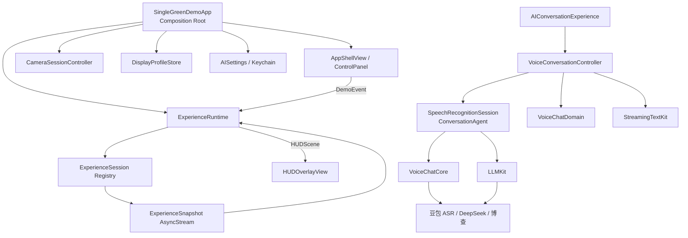

# 单绿显示实验室：项目架构、质量与模块化升级报告

> 文档状态：当前实现基线
>
> 最后审查：2026-08-27
>
> 适用工程：`SingleGreenDemo.xcodeproj`
>
> 当前版本：0.1（Debug / MVP）

## 1. 执行摘要

本项目已经从单页演示程序演进为一个小型、可扩展的单绿 HUD Experience 平台。平台负责相机环境预览、显示参数、统一交互事件、Experience 生命周期和 HUD 渲染；AI 对话以独立 Experience 接入，并通过 VoiceChatDomain、VoiceChatCore、LLMKit 与 StreamingTextKit 实现 ASR → LLM Agent → 联网搜索 → 字素安全流式显示。

当前架构评分为 **9.5 / 10**。最强的部分是单向依赖、Runtime 单一输出源、AI Ports/Adapters、独立流式文本模块、LLM 语义传输端口、可控异步依赖和关键路径测试。主要限制是真实 API 闭环尚未自动化、Swift 6 严格并发尚未完全开启、CI 尚未建立，以及外部开源分发前仍需补充许可证信息。

| 维度 | 评分 | 结论 |
| --- | ---: | --- |
| 简洁性 | 9.2 | 当前规模没有引入不必要的架构框架，核心路径清楚 |
| 模块化 | 9.6 | 流式文本、LLM Transport、Ports、Adapters 均有独立边界 |
| 可测试性 | 9.4 | 156 项测试，算法下沉到 Package 后可独立验证 |
| 可扩展性 | 9.4 | 新 Experience、打字策略和 LLM Transport 均可通过稳定接口接入 |
| 可移植性 | 9.3 | 依赖已纳入仓库；克隆后不再要求外部 sibling 目录 |
| 生产就绪度 | 7.3 | 仍缺真实 API E2E、CI、服务端短期凭证和完整观测体系 |

## 2. 产品定位与边界

### 2.1 当前目标

- 使用 iPhone 后置摄像头提供真实环境背景。
- 在摄像头画面上模拟单绿色 OST HUD 的布局、亮度和信息密度。
- 使用统一 Runtime 快速切换、演示和验证多种 Experience。
- 验证 AI 语音对话链路：流式 ASR、多轮 LLM、模型按需联网搜索。
- 为未来接入真实眼镜显示、手势输入、更多 AI 工具和远程数据源保留稳定接口。

### 2.2 明确非目标

- iPhone 叠加画面不等同于真实单绿眼镜的光学表现。
- 当前不是生产级账号、计费、数据同步或多用户系统。
- 当前 API Key 存在本机 Keychain，但不构成服务端鉴权隔离。
- 当前不承诺真实网络服务的稳定性；离线单元测试只验证编排与协议行为。

### 2.3 当前 Experience

| Experience | 数据来源 | 主要用途 |
| --- | --- | --- |
| SystemStatus | 本地状态与注入时钟 | 状态、时间、边界交互示例 |
| Navigation | 本地路线 Fixture | 多步骤、展开和边界事件示例 |
| Notification | 本地通知 Fixture | 打断、显示与关闭示例 |
| Caption | 本地字幕 Fixture | 连续推进、播放与停止示例 |
| AIConversation | 豆包 ASR + DeepSeek + 博查 | 异步后台更新、语音和 Agent 工具链示例 |

## 3. 当前总体架构



### 3.1 依赖方向

必须保持以下单向依赖：

```text
App / UI
   ↓
Runtime + Experience contracts
   ↓
Platform domain models

AIConversationExperience
   ↓
VoiceConversationController
   ↓
Ports
   ↓
Live adapters
   ↓
AiiOSStudy packages / system frameworks / network services
```

领域模型、Runtime 和 Experience 协议不得反向依赖具体 UI、相机、Keychain 或网络 SDK。生产适配器可以依赖外部模块，但控制器只应依赖端口。

## 4. 核心运行流程

### 4.1 普通 Experience 事件流

```text
用户按钮或手势
→ DemoEvent
→ ExperienceRuntime.handle
→ 当前 ExperienceSession.handle/reset
→ HUDScene + action title
→ Runtime 发布
→ HUDOverlayView 渲染
```

`ExperienceRuntime` 是当前场景、主动作标题和调试事件的唯一发布者。UI 不应直接从具体 Experience 读取 HUD 输出。

### 4.2 后台更新流

AI 对话不是一次输入对应一次同步输出。ASR 音量、实时转写、LLM 请求和搜索状态会在后台持续变化，因此 `ExperienceSession.updates()` 使用 `AsyncStream<ExperienceSnapshot>` 向 Runtime 推送最新状态。Runtime 只接受当前激活 Session 的更新，旧 Session 的延迟更新会被丢弃。

### 4.3 并发与竞态保护

Runtime 对激活和普通事件共用 `commandGeneration`：

1. 每个新命令递增 generation。
2. 异步 reset/handle 返回后检查 generation。
3. 同时检查处理命令的 Session 仍是当前 Session。
4. 任一条件不满足时，不再发布旧结果。

AI Controller 对回答使用独立 reply generation 和回复 UUID。重置、打断或新会话会取消旧任务；旧回复、旧失败和重复 finished 事件不能污染新会话。

LLM 网络累计文本与 HUD 可见文本分开管理：`ConversationState` 按 reply UUID 立即累加真实 SSE delta，`StreamingTextKit.TypewriterTextBuffer` 再以 Swift `Character` 边界和默认 33ms tick 平滑追平。节奏由 `TypewriterPolicy` 注入，Unicode 完成对齐与滚动判定也是无 UI 副作用的模块算法。Controller 只编排状态和 tick；所有网络事件与打字 tick 同时校验 UUID 与 generation。

### 4.4 AI 对话链路

```text
Runtime tap
→ AIConversationExperience
→ VoiceConversationController
→ 麦克风权限
→ VoiceChatCore.ASRSession
→ 累计 transcript
→ VoiceChatDomain.ConversationState
→ LLMKit.LLMAgent
→ 可选 web_search 工具
→ BochaSearchClient
→ 最终回答 SSE delta
→ ConversationState pending 累加
→ StreamingTextKit 字素安全展示
→ ConversationHUDMapper
→ ExperienceSnapshot
→ Runtime
→ HUD
```

状态机为：

```text
idle
→ connecting
→ listening
→ recognizing
→ thinking
→ searching（可选）
→ streaming
→ completed / failed
```

`LLMChatClient.completeMessageStreaming` 同时解析 `content` 与按 index 分片的 `tool_calls`。`LLMAgent` 仅依赖 `LLMChatTransport`，供应商 HTTP/SSE、本地模型或网关可以独立替换。`sendStreaming` 把单轮用户请求视为事务：最终无工具轮才提交助手上下文；失败或取消不得提交。

AI 回答布局使用专用 `flowingText` 元素，高度为 safeRect 的 61%，保持固定字号和左对齐。`HUDFlowingTextView` 通过尾部 anchor 自动上翻；Reduce Motion 下不执行逐字或滚动动画。流式中的文本对 VoiceOver 隐藏，完成后以整体文本提供读取，避免逐 token 播报。

## 5. 模块职责与稳定接口

| 目录或模块 | 责任 | 对外稳定接口 | 不应承担 |
| --- | --- | --- | --- |
| `App/` | Composition Root、页面装配、生命周期 | Environment Objects | 业务状态机、网络协议 |
| `Platform/Domain/` | HUD、事件、归一化几何 | 值类型模型 | SwiftUI 页面、SDK 实现 |
| `Platform/Runtime/` | 注册表、切换、事件串行语义、统一发布 | `ExperienceSession`、`ExperienceSnapshot` | 具体体验逻辑 |
| `Experiences/` | 每个体验自己的状态与事件映射 | `ExperienceSession` | 全局导航、其他体验状态 |
| `Platform/Rendering/` | 将 HUDScene 映射为视觉 | `HUDOverlayView` | 修改体验状态 |
| `Platform/Profiles/` | 视口、颜色、字体和强度配置 | `DisplayProfile` | 体验内容 |
| `Platform/Environment/` | 相机权限和 Session 生命周期 | `CameraSessionController` | HUD 或 AI 业务 |
| `Platform/AI/` | AI 用例、端口、生产适配器、配置 | ASR/Agent ports | App 页面布局 |
| `StreamingTextKit` | 打字节奏、字素缓冲、Unicode 对齐、自动尾随策略 | `TypewriterPolicy`、`TypewriterTextBuffer`、`StreamingTextReconciler` | 会话状态、SwiftUI 样式、网络 |
| `VoiceChatDomain` | 消息和回复生命周期 | `ConversationState` | 音频、网络、UI |
| `VoiceChatCore` | 音频、ASR WebSocket 和协议帧 | `ASRSession` | LLM 和 HUD |
| `LLMKit` | Chat Completions、SSE、上下文事务、工具循环、搜索 | `LLMChatTransport`、`LLMAgent` | 麦克风、HUD 和 App 生命周期 |

## 6. 配置与安全

### 6.1 当前存储策略

| 配置 | 存储 |
| --- | --- |
| ASR API Key | Keychain |
| LLM API Key | Keychain |
| 博查 API Key | Keychain |
| ASR Resource ID、语言、热词 | UserDefaults / AppStorage |
| LLM 模型、搜索开关、免按模式 | UserDefaults / AppStorage |

旧 `Volcengine.plist` 配置路径已删除。任何新凭证只能通过设置页、受控环境变量或未来的服务端签发流程注入，不得写入源码、plist、README、测试 Fixture 或截图。

### 6.2 生产升级要求

1. App 不直接持有长期供应商密钥；改为业务服务端签发短期 Token。
2. 为 ASR、LLM 和搜索分别配置超时、限流、重试上限与错误分类。
3. 日志只记录 request ID、阶段、耗时和错误类型，不记录原始 Key 或完整语音文本。
4. 明确语音与对话数据的隐私说明、保留周期和删除策略。
5. Keychain service 名称在 Bundle ID 变更时需要迁移方案。

## 7. 测试体系与当前证据

### 7.1 当前测试结果

2026-08-27 全量回归：

| 测试层 | 数量 | 结果 |
| --- | ---: | --- |
| App-hosted XCTest | 36 | 通过 |
| 平台 Core SwiftPM | 15 | 通过 |
| VoiceChatDomain | 14 | 通过 |
| VoiceChatCore | 25 | 通过 |
| LLMKit | 59 | 通过 |
| StreamingTextKit | 7 | 通过 |
| 合计 | **156** | **0 失败** |

构建证据：签名 App-hosted XCTest 通过；arm64 + x86_64 Simulator build 通过；Apple Development 签名的 iphoneos arm64 build 通过。用户已确认本轮重构前后的真机功能表现符合预期。

覆盖率：

| 目标 | 行覆盖率 |
| --- | ---: |
| SingleGreenDemo App | 65.72% |
| ExperienceRuntime | 90.65% |
| AIConversationExperience | 94.12% |
| VoiceConversationController | 91.01% |
| ConversationHUDMapper | 100% |

### 7.2 已覆盖的关键行为

- Experience 注册、重复类型拒绝和未知类型处理。
- 激活顺序、reset 等待和旧异步事件隔离。
- 后台 ExperienceSnapshot 进入 Runtime。
- HUD 归一化边界和安全区。
- 累计转写、重复结束事件去重和 ASR 错误。
- 麦克风拒绝、缺失配置和 Agent 失败。
- 搜索状态、配置快照、回复取消和上下文清理。
- 注入时钟驱动的免按 VAD，无真实等待。
- Domain 回复 UUID 隔离、失败回滚和旧回复防覆盖。
- pending delta 累加、部分失败保留、完成时机和 Reset 迟到事件隔离。
- StreamingTextKit 字素边界、combining scalar、自适应追平、可注入策略、Unicode 对齐和自动跟随。
- ASR 帧、gzip、LLM 编码、SSE 正文/工具分片、流式工具轮、重试、工具调用和博查响应。

### 7.3 尚未覆盖

- 带真实凭证的 ASR → LLM → 搜索端到端自动化。
- 网络切换、弱网、后台恢复和系统音频打断。
- 相机权限各状态的自动 UI 验收。
- VoiceOver、动态字体、横竖屏和不同设备尺寸矩阵。
- 长时间会话的内存、功耗、温升和上下文成本。

## 8. 模块化扩展指南

### 8.1 新增普通 Experience

1. 在 `ExperienceKind` 增加稳定标识；标识发布后不要随意修改。
2. 新建独立目录和 `ExperienceSession` 实现。
3. 将内部状态保持为私有，只输出 `HUDScene` 和主动作标题。
4. 同步变化在 `handle/reset` 返回后由 Runtime 发布。
5. 后台变化通过 `updates()` 发布 `ExperienceSnapshot`。
6. 在 Composition Root 注册，不在 Runtime 内写具体类型判断。
7. 至少增加初始状态、事件边界、reset、后台更新和竞态测试。

最小模板：

```swift
@MainActor
final class ExampleExperience: ExperienceSession {
    let kind: ExperienceKind = .example
    private(set) var scene: HUDScene = /* initial scene */
    var primaryActionTitle: String { "执行" }

    func handle(_ event: DemoEvent) async {
        // mutate private state, then rebuild scene
    }

    func reset() async {
        // restore deterministic initial state
    }
}
```

### 8.2 替换 ASR 供应商

- 新适配器实现 `SpeechRecognitionSession`。
- 将供应商事件归一化为 transcript、utterance、level、finished、failed。
- 不修改 `VoiceConversationController`。
- 在 `VoiceConversationDependencies.live` 或新的 Provider Factory 中切换。
- 增加协议映射、取消、重复完成和错误转换测试。

### 8.3 替换 LLM 或搜索供应商

- 只替换 LLM 网络/模型时，实现 `LLMChatTransport`，继续复用 `LLMAgent` 的上下文事务和工具循环。
- 替换整个 Agent 编排时，实现 App 层 `ConversationAgent`。
- 搜索或新工具实现 `LLMToolExecutor`，不将工具业务写入 Transport。
- 供应商配置形成不可变快照，在 `ConversationLiveAdapters.swift` 完成生产装配。

### 8.4 调整或复用打字效果

- 默认使用 `TypewriterPolicy.standard`，保持当前 33ms 节奏和约 15 tick 追平。
- 新产品通过构建新 `TypewriterPolicy` 调整节奏，不 fork buffer 代码。
- 复用 `StreamingTextReconciler` 处理 SSE 最终文本，不按 Character 索引拼接后缀。
- SwiftUI 样式可替换，但自动滚动判定继续复用 `StreamingTextAutoFollowPolicy`。
- 完整接口和升级检查表见 `docs/STREAMING_MODULES_UPGRADE_GUIDE.md`。

### 8.5 新增显示硬件 Profile

- 新建不可变 `DisplayProfile`，使用归一化 viewport 和 safe area。
- 保持 Renderer 与物理设备无关。
- 对每个内建 Scene 跑边界测试。
- 真实硬件适配优先新增 Profile/Renderer Adapter，不修改 Experience 内容。

## 9. 版本和兼容性策略

### 9.1 Experience 合约

- `ExperienceKind.rawValue` 视为持久化和分析事件标识，按兼容 API 管理。
- `DemoEvent` 优先做加法演进；删除事件前先完成调用方迁移。
- `ExperienceSnapshot` 新字段应提供默认语义，避免所有体验同时破坏。
- HUDScene 只表达展示意图，不携带 View、闭包或 SDK 对象。

### 9.2 Package 管理

当前 Xcode 工程引用仓库内 Package：

```text
Packages/VoiceChatDomain
Packages/VoiceChatCore
Packages/LLMKit
```

当前采用自包含 monorepo，以保证单仓库克隆和离线测试可复现。三个 Package 来源于 AiiOSStudy 提交 `f05467c9243e9ac498e1e2874a08445d3380b034`，同步规则记录在 `Packages/README.md`。每次 vendor 升级必须记录来源提交、迁移说明、测试结果和已知行为差异；不得直接覆盖后跳过审查。

### 9.3 本地数据迁移

- UserDefaults key 视为持久化 schema，不直接改名；先读旧值、写新值，再在后续版本清理。
- Keychain account 和 service 改名必须提供迁移和失败回退。
- 新设置需要明确默认值，并测试旧版本升级后的行为。

## 10. 当前风险与技术债

### P0：下一次对外分发前

1. **真实链路验收**：至少执行一次真机 ASR → LLM → 搜索，并保存脱敏结果。
2. **CI**：自动执行平台 Core、三个 Package 和 App Simulator 测试。
3. **凭证架构**：外部测试前改用服务端短期凭证或明确接受 Demo 风险。
4. **许可证**：对外开源或分发 vendored Packages 前补充明确的授权与 NOTICE。

### P1：下一轮模块化升级

1. 将 `ConversationDependencies.swift` 拆为 `Ports/`、`Adapters/` 和 `Configuration/`；当前 200 行仍可维护，但增长后会混杂。
2. 为控制面板定义 Experience 级 presentation model，进一步减少 UI 对 `VoiceConversationController` 细节的读取。
3. 把 `DisplayProfileStore` 的持久化、选择和远程配置能力从值模型中分开。
4. 增加结构化日志、阶段耗时、取消原因和失败分类。
5. 增加 UI 测试、弱网测试、后台恢复和音频中断测试。
6. 将 App 总体覆盖率从 65.72% 提升到 75% 以上，优先覆盖相机与设置边界。

### P2：规模扩大后

1. 将 Platform Domain/Runtime 抽为独立 Package，避免 Xcode Target 与根 SwiftPM source list 双重维护。
2. 为 Experience 增加能力声明，例如是否需要网络、麦克风、相机或后台更新。
3. 支持遥测、远程 Feature Flag、Profile 下载和 Experience 动态编排。
4. 完成国际化、无障碍和真实眼镜硬件适配。

### 已知编译警告

- `VoiceChatCore/AudioCapture.swift` 存在 `AVAudioPCMBuffer` 与捕获变量的 Swift 6 Sendable 警告。
- `LLMKitTests/QualityTests.swift` 存在未使用局部变量警告。

这些警告不影响当前测试通过，但在开启 Swift 6 complete strict concurrency 前必须处理。

## 11. 推荐演进路线

### 阶段 A：可复现工程（优先）

- 在首个 Git 基线上继续使用小步提交和版本 Tag。
- 为 vendored Packages 建立来源提交和升级记录。
- 新增 CI 和一键测试脚本。
- 清除 Swift 6 warning。

完成标准：任意新 Mac 克隆后，不依赖手工目录摆放即可构建并跑完离线测试。

### 阶段 B：供应商可替换

- 拆分 AI Ports、Adapters 和配置。
- 增加 ASR/LLM/Search Provider Factory。
- 增加供应商契约测试。
- 统一错误类型、超时和重试策略。

完成标准：替换任一供应商不修改 Controller、Experience、Runtime 或 UI。

### 阶段 C：真实设备质量

- 真机 E2E、弱网、音频打断、后台恢复。
- 性能、功耗、首帧、响应延迟和搜索耗时指标。
- 服务端短期凭证与脱敏日志。

完成标准：关键路径有可重复的设备验收数据和错误定位信息。

### 阶段 D：平台产品化

- Platform Core 独立 Package。
- Experience 能力声明和动态注册。
- 多 DisplayProfile、真实眼镜 Renderer/Input Adapter。
- 版本迁移、Feature Flag、灰度和回滚。

## 12. 开发和发布检查清单

### 提交前

- 没有 Key、Token、真实用户语音或对话进入仓库。
- 新 Experience 只通过 Runtime 输出 HUD。
- 所有异步任务支持取消，旧结果有身份或 generation 校验。
- 新依赖通过端口注入，测试不访问真实硬件或公网。
- 新设置有默认值和迁移策略。

### 测试

```bash
swift test --scratch-path /private/tmp/SingleGreenCoreTests

swift test \
  --package-path Packages/VoiceChatDomain \
  --scratch-path /private/tmp/VoiceChatDomainTests

swift test \
  --package-path Packages/VoiceChatCore \
  --scratch-path /private/tmp/VoiceChatCoreTests

swift test \
  --package-path Packages/LLMKit \
  --scratch-path /private/tmp/LLMKitTests

xcodebuild \
  -project SingleGreenDemo.xcodeproj \
  -scheme SingleGreenDemo \
  -destination 'platform=iOS Simulator,name=iPhone 17 Pro Max' \
  -derivedDataPath /private/tmp/SingleGreenDemoTests \
  -enableCodeCoverage YES \
  test
```

### 发布前

- 更新版本号和变更记录。
- Debug、Release、Simulator、目标真机均构建成功。
- 检查签名 Team、Bundle ID、隐私权限文案。
- 执行真实 ASR/LLM/Search 冒烟测试并确认搜索开关两条路径。
- 检查日志、截图和报告已经脱敏。
- 记录 Package 版本、Xcode/SDK 版本和测试总数。

## 13. 本次清理记录

本次审查将仓库收敛为“App 代码 + 仓库内 VoiceChat Packages + 测试 + Xcode 工程 + 根 SwiftPM 测试入口 + README + 文档”。删除对象均属于下列类别：

- 可再生成构建缓存：`.build`、`DerivedData`、`DerivedDataDevice`。
- 已脱离工程的依赖产物：`Pods`。
- 已脱离工程的顶层 Xcode workspace。
- Xcode 用户状态、索引状态和 `.DS_Store`。
- 已被设置页与 Keychain 替代的 Volcengine plist 配置文件。
- 已合并进本报告的旧 MVP、平台架构、功能模块和开发前决策文档。

不删除：App 源码、测试、图标资源、Xcode project、根 `Package.swift`、`.gitignore` 和 `Packages/` 中的三个 VoiceChat 源码 Package。

## 14. 架构决策摘要

| 决策 | 选择 | 原因 |
| --- | --- | --- |
| UI 架构 | SwiftUI + ObservableObject | 当前规模简单，原生工具足够 |
| Experience 边界 | `ExperienceSession` | 统一事件、reset 和输出，便于模块替换 |
| 输出通道 | Runtime 单一状态 + AsyncStream snapshot | 同时支持同步和后台更新 |
| 异步隔离 | generation + Session identity | 防止旧事件覆盖新场景 |
| AI 编排 | Controller + Ports/Adapters | 可独立测试和替换供应商 |
| 对话领域 | AiiOSStudy VoiceChatDomain | 复用稳定消息和回复生命周期 |
| ASR | VoiceChatCore | 复用音频、WebSocket 和协议实现 |
| LLM/Search | LLMKit | 复用上下文、工具循环和失败回滚 |
| 密钥 | Keychain | 避免明文配置文件；生产仍需短期凭证 |
| HUD 布局 | 归一化坐标 + DisplayProfile | 与设备尺寸和未来显示硬件解耦 |

## 15. 维护原则

后续升级时优先保护三个稳定面：

1. **体验合约稳定**：Experience 只处理自身状态，通过 Runtime 输出。
2. **领域与外部实现隔离**：状态机不直接创建系统或网络对象。
3. **异步结果有归属**：任何跨 await、流或回调的结果，都必须确认仍属于当前会话、当前回复或当前 Experience。

只要这三个原则不被破坏，项目可以在不重写上层 UI 的情况下持续增加 Experience、AI 工具、服务供应商和真实眼镜适配。
