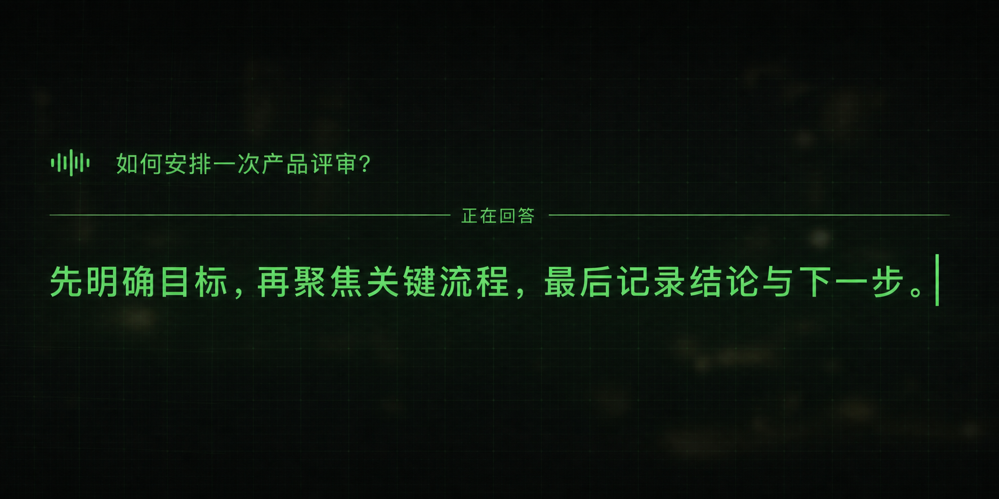
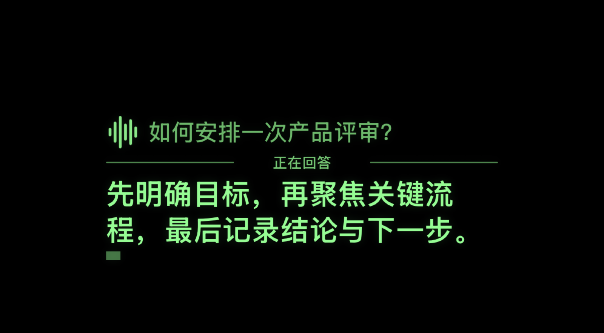
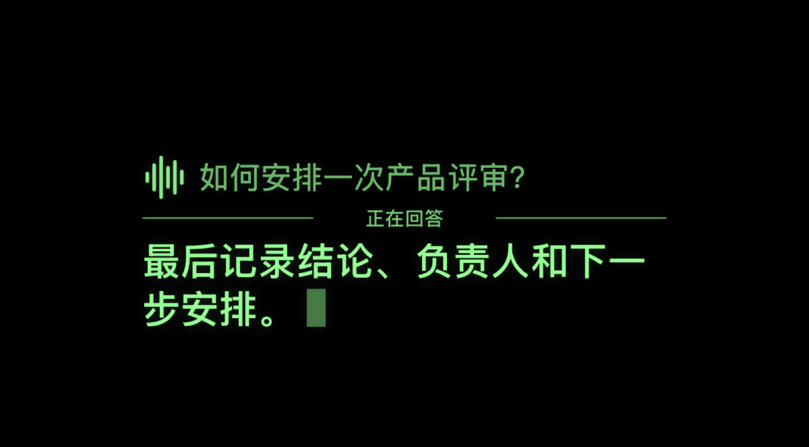

# AI 对话单绿 HUD 重设计 PRD

> 文档状态：产品与视觉方案已按最终 UI 稿更新，v0.4 已实现；待 VoiceOver、真实服务与真机验收
>
> 版本：v0.4
>
> 日期：2026-08-30
>
> 适用工程：`SingleGreenDemo.xcodeproj`
>
> 本文档同时记录已完成实现、实际 8:3 渲染对比与自动化证据；真实 DeepSeek 服务、VoiceOver 和真机光学效果仍须人工验证。

## 1. 背景与问题

当前 AI 对话 HUD 将状态图标、状态标题、用户问题和 AI 回答平均分成多层。受限于单绿显示区域的 8:3 矮屏比例，现有布局存在以下问题：

- 状态、问题和回答争夺同一视觉层级，第一眼不容易找到正在发生的事情。
- 用户问题与 AI 回答的字号和亮度接近，对话双方的主次不够明确。
- 状态标题占用横向空间，但没有连续表达“聆听 → 思考 → 回答”的流程。
- 思考、联网搜索和正式回答之间主要依赖文字替换，状态切换缺少空间上的连续性。
- 长回答虽然能够自动跟随尾部，但缺少稳定的阅读锚点。
- DeepSeek 思考模式的 `reasoning_content` 尚未被 Transport/Agent 正确处理；该协议数据需要支持工具轮回传，但不应进入眼镜 HUD。

本次重设计采用用户最终确认的极简方向：移除左侧阶段轨道，顶部保留动态语音波形与当轮问题；当前状态固定居中放在左右两段横线之间；正式回答使用更大字号和更高亮度。

## 2. 产品目标

### 2.1 核心目标

1. 用户在一秒内识别当前处于聆听、思考还是回答阶段。
2. AI 正式回答始终是视觉主角，用户问题作为较弱的上下文锚点保留。
3. 状态切换具有连续、克制的动效，不干扰真实环境观察。
4. HUD 只表达“正在思考”的语义状态，不显示、滚动或短暂闪现原始思维链。
5. 保留现有流式回答、取消、工具调用、上下文事务和 Unicode 安全契约。

### 2.2 非目标

- 不把 HUD 改造成手机聊天气泡或多卡片界面。
- 不在 HUD 内增加可点击控件；开始、打断、重试和设置仍由宿主控制面板承担。
- 不在本阶段改变 ASR、LLM、联网搜索供应商。
- 不把原始 `reasoning_content` 传入 Controller、HUDScene、Renderer、用户可见对话历史、日志或遥测；仅允许 LLMKit 在工具开启时按供应商协议保存在内存上下文中。
- 不提供“显示原始思考过程”的 Debug 或 Release 开关。
- 不以 iPhone VST 模拟结果替代真实 OST 光学、亮度、FOV 或户外可读性验证。

## 3. 已确认的视觉方向



该图用于确认信息结构、亮度层级、动态语音图标和“横线—状态—横线”语言。参考图约为 2:1，不能直接作为工程尺寸；实际实现必须投影到现有 `simulator.default.v2` 的 8:3 可见安全区。





### 3.1 设计原则

- 单色：只使用当前 Display Profile 的单绿色，通过透明度和字号建立层级。
- 回答优先：AI 回答使用最大字号与最高亮度。
- 问题弱化：用户问题保持可追溯，但不与回答竞争。
- 状态稳定：状态文字始终在两段横线的水平中心，只做文字替换，不让问题和回答重排。
- 语音可感知：顶部波形在对话进行时以低幅变化反映音量与活动状态。
- 低干扰：不使用卡片、聊天气泡、大面积底色、阴影、渐变或弹跳动效。
- 稳定阅读：正文左对齐、固定字号、固定两行视口；溢出后整行上移并跟随尾部，稳定态不得露出半行文字。

## 4. 信息架构与布局

### 4.1 画布与安全区

| 项目 | 要求 |
| --- | --- |
| 可见比例 | 保持现有 8:3 |
| 宿主宽度 | 保持 `surfaceWidthFraction = 0.90` |
| 宿主位置 | 保持当前 `verticalOffsetFraction = -0.20`，本需求不再次移动整个 HUD |
| 内容安全区 | 继续由 `DisplayProfile.viewport` 与 `safeArea` 投影 |
| 对齐 | 整体水平居中；HUD 内部正文左对齐 |
| 调试边框 | 仅 Debug 显示；普通模式不显示虚线边框 |

### 4.2 归一化布局建议

以下坐标相对于 HUD 可见安全区，不是手机屏幕坐标：

| 区域 | 建议范围 | 内容 |
| --- | --- | --- |
| 动态语音波形 | `x: 0.04–0.12, y: 0.06–0.26` | 对话活动时做低幅循环，并根据 `audioLevel` 缩放 |
| 用户问题 | `x: 0.14–0.96, y: 0.06–0.26` | 单行优先，最多两行 |
| 左段横线 | `x: 0.04–0.34, y: 0.345` | 一像素至一个 profile lineScale |
| 当前状态 | `x: 0.36–0.64, y: 0.295–0.405` | 水平居中；固定宽度可容纳“正在联网搜索”且不在切换时重排 |
| 右段横线 | `x: 0.66–0.96, y: 0.345` | 与左段对称，不穿过状态文字 |
| 主内容视口 | `y: 0.43–0.96` | 思考状态指示器或 AI 正式回答 |

### 4.3 字体与亮度层级

| 元素 | 建议字号 | 字重 | 相对亮度 |
| --- | ---: | --- | ---: |
| 语音波形 | 占顶部安全高度 20% | semibold | 静止 68%，活动 92% |
| 用户问题 | `15–16pt × textScale` | medium | 普通阶段 72%，聆听阶段 88% |
| 分割线 | — | — | 52% |
| 当前状态 | `13–14pt × textScale` | semibold | 普通状态 78%，失败 95% |
| 思考状态圆点 | 直径 `4–5pt × lineScale` | — | 35%–90% 循环 |
| AI 正式回答 | `20–22pt × textScale` | semibold | 95%–100% |
| 错误说明 | `15–17pt × textScale` | semibold | 85%–100% |

字号必须在真实 8:3 安全区中验证。正文不得为塞入更多内容而动态缩小；空间不足时使用固定视口和自动跟随。

## 5. 对话状态与 UI 变化

### 5.1 状态映射

| 领域状态 | 横线中间的状态文字 | 主内容区 |
| --- | --- | --- |
| `idle` | `等待开始` | `AI 回答会显示在这里` |
| `connecting` | `正在连接` | 保留引导文案 |
| `armed` / `listening` | `正在聆听` | 实时更新用户问题，波形响应音量 |
| `recognizing` | `正在识别` | 固定最终用户问题，显示三点处理指示器 |
| `thinking` | `正在思考` | 显示三点思考指示器，不显示推理文本 |
| `searching` | `正在联网搜索` | 保持三点指示器，不显示工具原文或凭证信息 |
| `streaming` | `正在回答` | 高亮显示正式回答并流式追平 |
| `completed` | `回答完成` | 光标消失，正文保持稳定 |
| `failed` | `对话失败` | 显示用户可行动的错误与重试提示 |

### 5.2 用户问题

- ASR 未完成时，问题区可以流式更新，但最多两行。
- 进入 `recognizing` 后冻结为本轮最终问题，后续思考和回答阶段不得重排。
- 问题始终使用较小字号与较低亮度。
- 新一轮问题到来时，旧问题与旧回答一起退出，不保留聊天历史列表。

### 5.3 思考状态

思考态只表达“系统仍在工作”，不展示模型的原始推理内容。

- 不显示左侧阶段节点或阶段名称，避免狭高的 8:3 视口中同时存在两套状态表达。
- 横线中心标签固定为“正在思考”；发生工具调用时只替换为“正在联网搜索”。
- 主内容视口中央显示三个等距小圆点。圆点位置、尺寸和占位始终固定，只通过透明度依次变化表达持续处理。
- 三点指示器不显示阶段文案、百分比、耗时估计、推理摘要或模型自我修正内容。
- 正式 `content` 的首个增量到达后，三点指示器立即退出，回答接管同一主内容视口。
- 取消、Reset、后台切换、更新 generation、工具失败或不完整流必须立即停止旧思考动画。

DeepSeek Chat Completions 在思考模式下仍可能通过 `reasoning_content` 返回协议数据。Transport/Agent 必须在内部完成解析：只要请求携带 `tools`，当前工具子轮以及此前已保留的助手轮次都要完整回传对应字段；这些数据不得向 UI 层发布。未携带 `tools` 时不保留历史推理。

#### 5.3.1 思考态静态线框

```text
≋  用户问题（小字号、低亮，最多两行）

─────────  正在思考  ─────────

                •   •   •
```

- 三个圆点作为一个整体在主内容视口内水平、垂直居中。
- 圆点间距保持 `8–10pt × lineScale`，不得因动画改变占位。
- “正在联网搜索”只替换分割线标签，线框和圆点位置保持不变。

官方协议参考：

- [DeepSeek Thinking Mode](https://api-docs.deepseek.com/guides/thinking_mode/)
- [DeepSeek Chat Completions API](https://api-docs.deepseek.com/api/create-chat-completion/)

### 5.4 正式回答

- 回答使用最高亮度与最大字号，是主视觉焦点。
- 回答可见区固定为两行，工程高度为 `2 × 24pt × textScale`，不使用允许第三行露出一部分的弹性高度。
- 保留现有 `TypewriterPolicy.comfortableReading`：150ms tick、Swift `Character` 边界和积压追平策略。
- 首个正文 delta 到达后，目标在 150ms 内出现首个可见字符。
- 溢出后按整行向上推进，当新行形成时用 `300ms linear` 完成一个行高的上移；动画结束后只保留最新两个完整行。
- 不改变字号，不突然跳到全文末尾，不在两行之上残留上一行的半行字形。
- 回答完成后光标消失；失败时保留已显示的部分回答，并在底部给出“回答中断，请重试”。

## 6. 动效规范

### 6.1 通用原则

- 动效用于解释状态变化，不用于装饰。
- 同一时刻最多有一个主要动效焦点。
- 不使用弹簧、抖动、旋转、呼吸式大面积闪烁或强烈辉光。
- 所有动画必须受 reply identity 与 generation 隔离；旧回复动画不能覆盖新一轮。

### 6.2 动效时序

| 场景 | 动效 | 时长 / 节奏 |
| --- | --- | --- |
| 语音波形 | 对话活动时使用系统 `waveform` 变色循环，叠加 `audioLevel` 的 94%–106% 低幅缩放 | 音量跟随 `120ms easeOut`，循环由系统节奏驱动 |
| 问题确认 | 透明度由 70% 降至 55%，垂直位移 `2pt → 0` | `140ms easeOut` |
| 状态标签替换 | 旧标签淡出、新标签淡入，不改变基线 | `120ms crossfade` |
| 进入思考态 | 三个圆点整体淡入，圆点不发生位移或缩放 | `120ms easeOut` |
| 思考循环 | 三点按左→中→右依次执行 `35% → 90% → 35%` 透明度波；每点相位相差 `160ms`，不改变大小 | `960ms easeInOut` 循环 |
| 思考 → 搜索 | 三点循环不中断，仅将状态标签交叉淡化为“正在联网搜索” | `120ms crossfade` |
| 思考 → 回答 | 三点在首个正文 delta 到达时淡出；中心状态替换为“正在回答”，正文立即接管同一视口 | `100–140ms`，不得阻塞首字显示 |
| 回答逐字显示 | 保持现有 comfortableReading 策略 | `150ms / tick` |
| 答案换行溢出 | 新行从底部进入，旧行按一个完整行高向上退出；稳定后精确裁切为两行 | `300ms linear` |
| 流式光标 | 低幅度透明度变化，不改变布局 | `600ms` 周期 |
| 完成 | 光标淡出，状态替换为“回答完成” | `120ms` |
| 失败 | 状态替换为“对话失败”并显示可行动说明；不震动 | `160ms crossfade` |
| Reset / 新一轮 | 当前内容整体淡出后进入新 generation | `120ms`，清理不等待动画完成 |

进入思考态时，中心状态在 `120ms` 内替换，三点从 `100ms` 开始淡入，首次循环从 `220ms` 开始。退出时以正文首个 delta 为准，网络与正文显示不等待动画完成。

### 6.3 Reduce Motion

- 系统开启 Reduce Motion 时，语音波形保持静态，禁用位移动画和光标闪烁。
- 三个思考圆点固定显示为 70% 亮度，不循环、不闪烁。
- 状态和回答内容直接刷新；流式回答仍保证 Character 安全。
- 自动跟随直接跳到尾部，不执行滚动动画。

## 7. 宿主 UI 变化

### 7.1 AI 设置页

- 本需求不新增“显示原始思考过程”开关。
- Debug 与 Release 使用相同的思考态 HUD；Debug 只保留现有安全区和诊断辅助，不改变用户可见的 AI 内容。
- 如未来需要开放推理摘要，应作为新的产品能力单独评审，不得复用原始 `reasoning_content` 直接展示。

### 7.2 调试诊断条

- 可以显示语义状态 `thinking`、`searching`、`answering`。
- 只记录时延、字符数、工具轮次数和终态等结构化数据。
- 禁止记录问题正文、`reasoning_content`、回答正文、工具参数和工具原始结果。

### 7.3 控制面板

- `开始对话`、`结束聆听`、`打断并开始新对话`、`重试`的现有行为保持不变。
- HUD 仍为只读显示层，不增加触控命中区域。

## 8. 数据与架构需求

### 8.1 LLMKit

- `LLMMessage` 增加可选 `reasoningContent`，编码键为 `reasoning_content`。
- `LLMSSEChunk.Choice.Delta` 增加可选 `reasoningContent`。
- 流式 accumulator 在 Transport 内部分别累计推理、正文和工具调用；最终通过完成消息把协议所需的推理内容交给 Agent。
- `LLMStreamingEvent` 不向上层新增 `reasoningDelta`；原始推理不得进入 Agent UI 事件流。
- 思考模式请求明确携带开关与 reasoning effort；不得依赖供应商默认值。
- 思考模式下不依赖 `temperature`、`top_p` 等官方声明无效的参数。

### 8.2 Agent 与工具调用

- 工具轮次必须把完整 `reasoning_content` 连同 `content`、`tool_calls` 一起保留并回传。
- 请求携带 `tools` 时，最终助手回答的 `reasoning_content` 也要保留在 LLMKit 内存协议上下文，并计入 token 预算，供下一用户轮回传；请求不携带 `tools` 时不保留。
- 供应商在工具轮返回的未发布正文前导语必须丢弃，不得显示或作为最终回答提交；若正文已发布后才出现工具调用，则继续失败回滚，避免无法撤销的混合输出。
- 只有正式回答成功完成、显示追平并被 Domain 接受后才提交对话上下文。
- `LLMAgentEvent` 和 `ConversationAgentEvent` 不增加原始推理事件；禁止把推理文本误发布为正文或提交为最终回答。

### 8.3 Controller 与 Domain

- 不增加 reasoning buffer，不让 VoiceChatDomain 保存或理解原始推理。
- 复用现有 `.thinking`、`.searching`、`.streaming` 语义状态生成 HUD 投影。
- 思考动画只由当前 scene 的稳定状态驱动；取消、Reset、失败和更新 generation 后，旧状态不得继续驱动 Renderer。
- 正文首个 delta 继续沿用现有 reply identity、generation 和 display scheduler，不改变上下文提交边界。

### 8.4 HUDScene 与 Renderer

- 语音波形、左右横线和中心状态应由通用 HUD 语义元素描述，不让 SwiftUI View 直接读取具体 Controller。
- Renderer 只负责测量、亮度、字体和动效，不判断联网、工具或上下文事务。
- 思考指示器应是通用 HUD 语义元素或明确的 scene 内容，不允许 Renderer 通过 `sceneID` 硬编码 AI 业务分支。
- Renderer 从 scene 判断是否显示和运行动画，不读取设置单例、LLM 事件或 Controller。

## 9. 可访问性与内容安全

- VoiceOver 进入思考态时只播报一次“正在思考”；循环圆点对辅助功能隐藏。
- 正式回答完成后提供一次稳定的可访问性文本。
- 错误文案必须可行动，不暴露 HTTP body、供应商错误原文或凭证状态细节。
- 问题与回答都必须支持中文、中英混排、emoji、ZWJ 和 combining marks。
- 高亮与弱化不能只依赖颜色差异，还必须同时使用字号、字重和位置层级。
- 原始思维链在所有构建模式均不展示；仅允许在工具开启期间由 LLMKit 保存在受 token 预算约束的内存协议上下文中，不写磁盘、日志或遥测正文。

## 10. 验收标准

### 10.1 Given / When / Then

| ID | Given | When | Then |
| --- | --- | --- | --- |
| AC-1 | AI 对话空闲 | 用户开始对话 | 中心状态显示“正在聆听”，位于左右横线之间，HUD 不重排 |
| AC-2 | 正在录音 | 音量变化 | 顶部语音波形做低幅反馈，不改变问题和回答布局 |
| AC-3 | ASR 输出最终问题 | 进入 recognizing | 问题固定在顶部弱层级，中心状态改为“正在识别” |
| AC-4 | 进入 thinking | 状态稳定 | 分割线显示“正在思考”，主内容区仅显示固定位置的三点指示器 |
| AC-5 | DeepSeek 持续返回 reasoning delta | 任意构建模式 | HUD 不显示推理文本，也不因单个推理 delta 触发 UI 更新 |
| AC-6 | 思考模式请求携带工具 | 执行后续工具轮或下一用户轮 | 完整 `reasoning_content` 只在 LLMKit 内存协议上下文中回传并计入 token 预算，不进入 UI、用户可见历史或日志 |
| AC-7 | 首个正式 content delta 到达 | 回答开始 | 中心状态替换为“正在回答”，思考指示器退出，首字目标 150ms 内可见 |
| AC-8 | 正式回答持续到达 | 内容形成第三行 | 固定字号、Character 安全，旧行整行上移，稳定态只显示最新两个完整行，不露出半行 |
| AC-9 | 回答正常结束 | 显示追平 | 光标消失、状态变为完成、上下文才允许提交 |
| AC-10 | 工具或流中途失败 | 已显示部分内容 | 不提交上下文；保留可用部分并显示可行动错误 |
| AC-11 | 用户打断、Reset 或进入后台 | 清理发生 | 三点循环立即停止，旧工具和正文事件不能更新 HUD |
| AC-12 | Reduce Motion 开启 | 进入 thinking | 三点以固定 70% 亮度显示，无循环、缩放、位移或闪烁 |

### 10.2 测试矩阵

| 层级 | 必测内容 |
| --- | --- |
| LLMKit 单元测试 | 非流式/流式 `reasoning_content` 解码；内部累计；工具轮回传；首 choice；完成信号；不完整流 |
| Agent 单元测试 | 多轮工具调用、跨用户轮推理回放、无推理 UI 事件、最终提交、取消、未发布工具前导语兼容、已发布混合正文/工具失败 |
| Controller 单元测试 | reply/generation 隔离、thinking/searching/streaming 状态映射、正文接管、Reset、后台恢复 |
| StreamingTextKit | 40/120/200 字、中文、中英混排、emoji、ZWJ、combining scalar、Reduce Motion |
| App-hosted XCTest | 8:3 几何、动态波形、左右横线、居中状态、思考指示器、两行回答视口、长文本溢出渲染、Reduce Motion、无障碍标签 |
| Simulator 人工检查 | 深色/浅色/复杂相机背景，所有状态，长文本自动跟随，字号与亮度层级 |
| 真机人工检查 | 真实麦克风、真实 DeepSeek、联网搜索、弱网、打断、户外/室内可读性 |

自动化测试必须使用 fake transport、确定性 SSE、URLProtocol 和注入时钟，不消耗真实凭证。

## 11. 性能与遥测

- 首个正式 delta 到首个可见字符目标：`≤ 150ms`。
- 原始 reasoning delta 不发布到 HUD，因此不得导致 SwiftUI scene revision 或布局刷新。
- HUD 更新不得阻塞网络读取、工具调用或主线程输入处理。
- 遥测允许：thinking/searching/answering 阶段耗时、answer 字符数、工具轮次、取消/失败分类。
- 遥测禁止：问题、`reasoning_content`、回答、工具参数、搜索结果和凭证正文。

## 12. 分阶段实施建议

### PR1：DeepSeek Thinking 协议契约

- 扩展 LLMKit 消息、请求、SSE Delta 和内部 accumulator。
- 加入 DeepSeek thinking 配置与工具轮回传测试。
- 不新增推理 UI 事件，不改变 HUD。

### PR2：HUD 语义结构

- 扩展通用 HUDScene 语义元素，表达语音波形、左右横线、居中状态和思考指示器。
- 重写 ConversationHUDMapper 的 8:3 信息结构，复用现有 Controller 状态。
- VoiceChatDomain、Conversation 端口和 StreamingTextKit 不增加推理概念。

### PR3：Renderer 与动效

- 实现顶部动态语音波形、问题弱层、对称分割线、中心状态、三点思考态和高亮回答。
- 保留 8:3、`0.90` 宽度、`-0.20` 垂直位置和 150ms 正文节奏。
- 使用稳定元素 ID 驱动透明度动画，完成 Reduce Motion 与无障碍行为。

## 13. v0.3 实现与验证记录

### 13.1 已实现

- `LLMKit`：显式发送 DeepSeek thinking 与 effort；解析并内部累计 `reasoning_content`；不新增 reasoning UI event；工具开启时跨子轮、跨用户轮回放，并纳入 token 预算。
- 工具兼容：同一未发布响应中的正文前导语与 `tool_calls` 可安全执行，前导语不进入 UI 或持久上下文；正文已经发布后才出现工具调用时仍失败回滚。
- `SingleGreenGlassesKit`：通用 HUD 元素支持字号层级、对齐、透明度、缩放、分割线、活动指示器和无障碍语义角色；保留旧初始化器符号。
- `ConversationHUDMapper`：移除左侧三阶段轨道，完成动态波形、弱化问题、左右对称横线、居中状态、三点思考态和高亮回答视口。
- Renderer：语音波形使用系统 Symbol Effect 和实时音量缩放；保留三点 `960ms` 循环与 `160ms` 相位、标签 `120ms`、流式光标和 Reduce Motion 静态回退。
- v0.4 回答视口：仅对 `.answer` 样式使用精确两行高度和底部锚定裁切；第三行形成后以 `300ms linear` 上移，不影响其他体验的通用 flowing text 滚动逻辑。
- 无障碍：波形与分割线从辅助功能树隐藏；唯一状态元素标记为动态更新。VoiceOver 的实际播报次数仍列为人工验收项。

### 13.2 自动化证据（2026-08-29）

| 门禁 | 结果 |
| --- | --- |
| `Packages/LLMKit` | 78/78 通过 |
| `Packages/SingleGreenGlassesKit` | 189/189 通过 |
| `Packages/StreamingTextKit` | 7/7 通过 |
| `Packages/SingleGreenConversationAdapters` | 24/24 通过 |
| `SingleGreenDemoTests` / iPhone 17 Pro Simulator 26.5 | 63/63 通过；新增两行高度规则与长文本流式渲染用例，并验证 `300ms` 上滑常量；xcresult：`/tmp/SingleGreenDemo-300msHUDFinal/Logs/Test/Test-SingleGreenDemo-2026.08.30_01-45-29-+0800.xcresult` |
| generic iOS Simulator build | 通过；仅有无 AppIntents 依赖的 metadata skip 警告 |
| 架构与 API 门禁 | 架构、package inventory 与 public API baseline 全部通过；旧 public initializer 无删除，新增 API 快照已人工接受 |
| 视觉对比 | `design-qa.md` 通过；已保存参考图与实际 8:3 渲染图 |

### 13.3 尚未替代的人工验收

- 在真机 8:3 显示区逐状态检查字号、对比度、长文本溢出与三点动画。
- 开启 Reduce Motion 与 VoiceOver，确认视觉静态回退及“正在思考”不重复播报。
- 使用真实 DeepSeek thinking + Bocha 搜索验证工具前导语、跨用户轮回放和弱网中断。
- 真机分别完成构建、安装、启动与真实单绿光学可读性验证；本记录不代表这些门禁已经通过。

### PR4：集成验证

- 运行 App XCTest、Simulator build、视觉矩阵和静态门禁。
- 真机、真实 DeepSeek 和真实搜索作为独立门禁记录。

## 14. 发布门禁与残余风险

- 必须分别记录测试、Simulator build、签名 build、真机安装、真机启动和真实服务验证。
- DeepSeek API 协议可能继续演进，实施前重新核对 thinking、模型名和工具调用要求。
- 原始思维链可能包含自我修正、冗余内容或不适合终端用户的中间判断，因此所有构建模式均不展示。
- 8:3 iPhone VST 只能验证排版与相对可读性，不能证明真实单绿眼镜的亮度、透明度和光学舒适性。
- 最终字号、亮度、横线留白和状态居中效果必须经过真机及目标光学设备人工验收。

## 15. 设计生成 Prompt（已确认极简方向）

```text
Create four matched standalone 8:3 monocular green AI conversation HUD states: listening, thinking, web searching, and answering.

At the top left, use a real waveform icon with subtle animated activity. Place the current user question beside it in smaller, dimmer green type. Below, draw a thin horizontal divider as two symmetric line segments with the current status exactly centered in the gap: “正在聆听”, “正在思考”, “正在联网搜索”, or “正在回答”. Never place the status above, below, or at either end of the divider.

For thinking and web searching, show only three small evenly spaced dots in the main content viewport. Keep their positions and sizes fixed; the intended motion is a subtle left-to-right opacity wave. Do not show chain-of-thought, reasoning text, summaries, percentages, or time estimates. For answering, replace the dots with the AI answer in substantially larger, brighter, semibold green type and a slim streaming cursor.

Do not use a left stage rail, stage nodes, stage labels, cards, chat bubbles, panel backgrounds, large enclosing borders, gradients, shadows, phone bezels, OS chrome, controls, or extra text. Use monochrome phosphor green only, relying on font size, weight, and opacity for hierarchy. Keep generous safe margins and a transparent dark live-camera background.
```
